# Rencar - Araç Kiralama Mobil Uygulaması

Rencar, dakikalık, saatlik ve günlük planlarla araç kiralamayı sağlayan bir Android uygulamasıdır. Kullanıcı haritadan yakınındaki müsait araçları görür, plan seçip rezerve eder, sürüş öncesi ve sonrası araç fotoğraflarını yükler, yolculuk boyunca anlık ücreti ve aracın canlı konumunu takip eder, sonunda cüzdan veya kartla ödeme yapar. Kiralamanın tüm yaşam döngüsü (PREPARING → ACTIVE → COMPLETED) sunucu tarafındaki durumla senkron yürütülür.

Uygulama Jetpack Compose ile yazıldı; sunum katmanında MVI ve tek yönlü veri akışı, veri katmanında Repository deseni kullanıldı. Üç canlı üçüncü parti entegrasyonu içerir: cihaz üzerinde yüz eşleştirmeyle ehliyet doğrulama (Google ML Kit + TensorFlow Lite), Socket.IO ile canlı araç konumu ve İyzico sandbox ile gerçek ödeme akışı. Açık ve koyu tema tüm ekranlarda desteklenir.

Proje, aşağıda listelenen gerçek kod referanslarıyla desteklenen bir MVI mimarisine ve üç canlı üçüncü parti entegrasyonuna (Google ML Kit / TensorFlow Lite, Socket.IO, İyzico) sahiptir.

**Repo:** [github.com/melikesukocyigit/Rencar-pair](https://github.com/melikesukocyigit/Rencar-pair)

---

## 1. Dokümantasyon Haritası (Navigation Map)

Bu README, projenin tüm teknik dokümantasyonunu tek dosyada toplayan merkezi kaynaktır. Aşağıdaki bağlantılarla ilgili bölüme doğrudan atlayabilirsiniz:

### 1.1. Genel Bakış
- [Ekran Görüntüleri ve Açıklamaları](#2-ekran-görüntüleri-ve-açıklamaları)
- [Mimari ve Sunum Katmanı (MVI)](#4-mimari-ve-sunum-katmanı-mvi-deseni)
- [Teknoloji Yığını](#6-teknoloji-yığını-tech-stack)

### 1.2. Teknik Derinlik
- [Yüz Doğrulama AI Pipeline'ı](#31-on-device-yapay-zeka-ile-yüz-doğrulama-face-matching-ai-pipeline)
- [Canlı Konum ve Socket.IO Entegrasyonu](#32-canlı-konum-ve-soket-entegrasyonu-socketio--linear-interpolation)
- [Harita ve Konum Yönetimi](#33-gelişmiş-harita-ve-konum-yönetimi-maplibre-sdk)
- [İyzico Ödeme Entegrasyonu](#34-i̇yzico-sandbox-ortak-ödeme-entegrasyonu)

### 1.3. Kalite ve Güvenilirlik
- [Kod Kalitesi ve Test Standartları](#5-kod-kalitesi-ve-test-standartları)

### 1.4. Yapı ve Kurulum
- [Proje Dizin Yapısı](#7-proje-dizin-yapısı)
- [API ve Veri Katmanı Eşleştirmesi](#8-api-ve-veri-katmanı-eşleştirmesi)
- [Kurulum ve Çalıştırma](#9-kurulum-ve-çalıştırma)
- [Ekip](#10-ekip)

---

## 2. Ekran Görüntüleri ve Açıklamaları

Uygulamadaki her ekranın, kayıt olma anından ödemeye ve kiralama geçmişine kadar, gerçek cihaz görüntüsü ve arkasındaki kod/mimari kararla birlikte kapsamlı dökümü.

### 2.1. Kimlik Doğrulama (Onboarding, Kayıt, Giriş)

Uygulama açılışından hesap oluşturmaya ve telefon numarası ile OTP doğrulamasına kadar olan akış. Referans MVI implementasyonu (bkz. [Bölüm 4](#4-mimari-ve-sunum-katmanı-mvi-deseni)) bu paketin altındaki `ui/auth/login/` ekranıdır.

| Onboarding | Kayıt Ol (Register) |
| :---: | :---: |
| 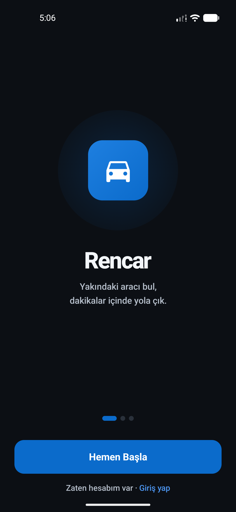 | 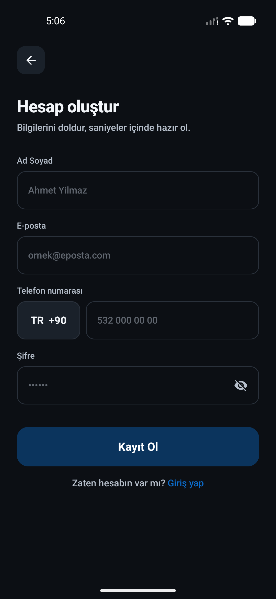 |
| Uygulamanın ilk açılış ekranı. "Hemen Başla" Kayıt akışına, alttaki "Giriş yap" bağlantısı doğrudan Login ekranına yönlendirir. Sayfa altındaki üç noktalı gösterge (bu ekran + 2 tanıtım sayfası daha) yatay kaydırmalı bir pager ile yönetilir. | Ad soyad, e-posta, telefon (+90 sabit ülke kodu) ve şifre alınır. Register çağrısı (`POST /auth/register`) başarılı olduğunda token kaydedilmez; kullanıcı doğrudan OTP akışıyla giriş yapmaya yönlendirilir. |

| Giriş Yap (Login) | Telefon Doğrulama (OTP) |
| :---: | :---: |
| 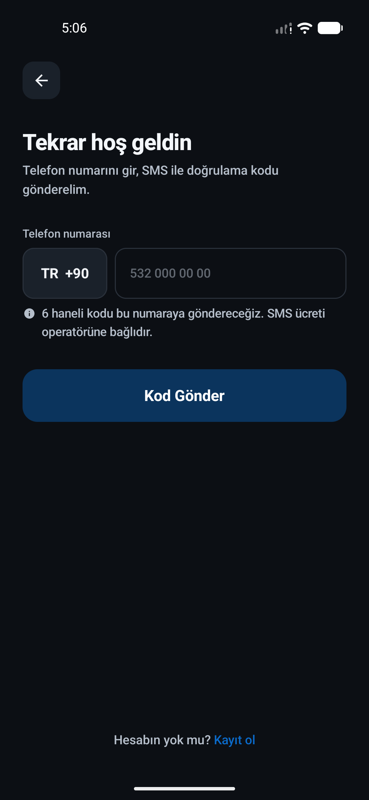 | 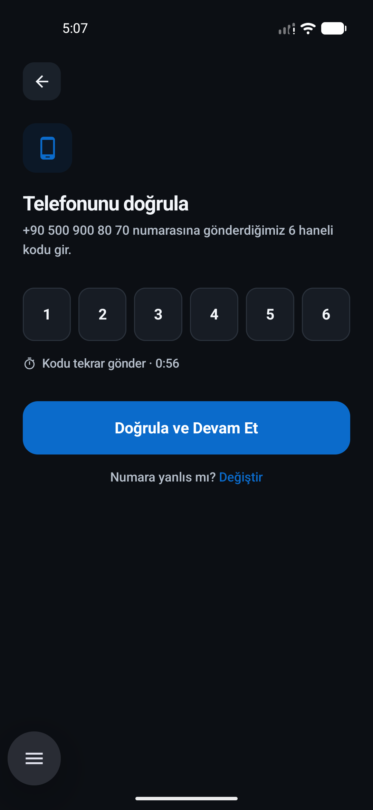 |
| Şifre yok — yalnızca telefon numarası. "Kod Gönder" `POST /auth/login` çağrısını tetikler ve kullanıcıyı OTP ekranına yönlendirir. Bu ekran, projenin MVI State/Intent/Effect kurallarının referans implementasyonudur. | 6 haneli SMS kodu girilir, `POST /auth/verify-otp` çağrılır. "Kodu tekrar gönder" sayacı `OtpViewModel` içinde sabit 60 saniyeye ayarlanmış olarak akar (backend'in `expiresAt` alanı ayrıştırılmaz). |

### 2.2. Ehliyet Doğrulama — Yapay Zeka Destekli Onay

Kiralama yapabilmek için tek seferlik ehliyet doğrulaması. ML Kit yüz tespiti + TensorFlow Lite ile cihaz üzerinde selfie/ehliyet fotoğrafı eşleştirmesi yapılır (bkz. [Bölüm 3.1](#31-on-device-yapay-zeka-ile-yüz-doğrulama-face-matching-ai-pipeline)). Eşik geçilirse kullanıcı, admin incelemesini beklemeden anında onaylanabilir.

| 1/3 — Ehliyet Fotoğrafları | 2/3 — Selfie Doğrulaması |
| :---: | :---: |
| 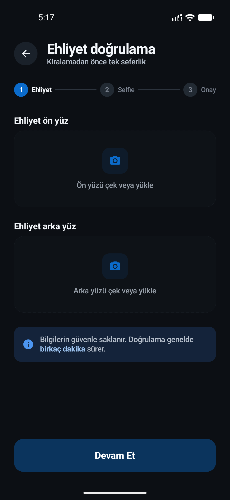 | 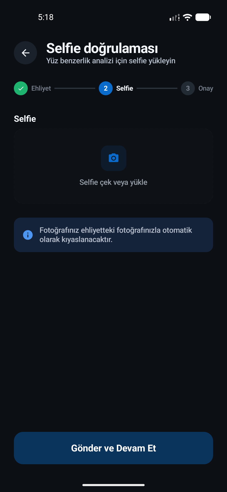 |
| Ehliyetin ön ve arka yüzü kamera veya galeriden yüklenir. Bu adım tamamlanmadan Selfie adımına geçilemez (3 adımlı bir wizard: Ehliyet → Selfie → Onay). | Kullanıcıdan canlı bir selfie istenir; bu görsel bir sonraki adımda ehliyetteki fotoğrafla karşılaştırılacaktır. Bilgilendirme metni bunu açıkça belirtir. |

| 3/3 — Yapay Zeka Analizi | Onay Tamamlandı |
| :---: | :---: |
| 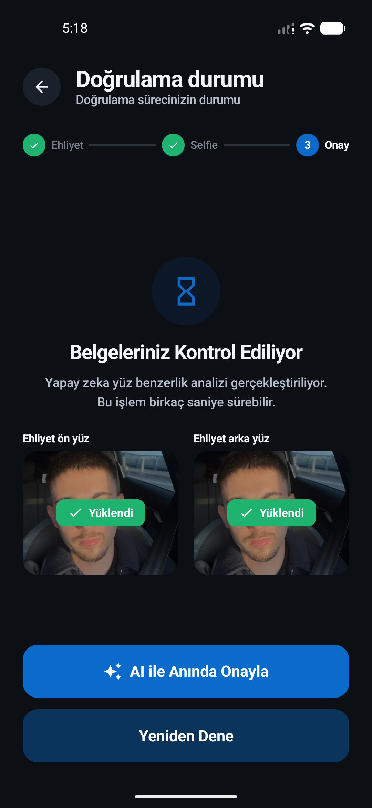 | 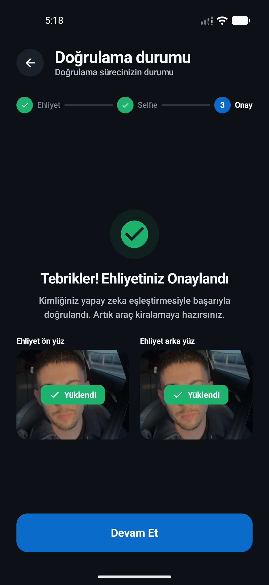 |
| Yüklenen ehliyet ve selfie görüntüleri yan yana gösterilir; ML Kit + TFLite ile cihaz üzerinde benzerlik skoru hesaplanır. Eşik geçilirse "AI ile Anında Onayla" butonu aktif olur. | Buton tetiklendiğinde backend'de tanımlı sabit bir demo admin hesabıyla anlık login yapılıp `PATCH /admin/licenses/{id}/approve` çağrılır — yalnızca demo/MVP kapsamında kabul edilebilir bir kısayoldur. |

### 2.3. Araç Keşfi — Harita, Detay ve Rezervasyon

Ana ekran kullanıcının konumuna yakın araçları MapLibre GL üzerinde fiyat etiketleriyle gösterir; bir araca dokunulduğunda detay sheet'i, oradan da rezervasyon onayı ekranına geçilir.

| Ana Ekran — Harita | Araç Detay Sheet'i |
| :---: | :---: |
| 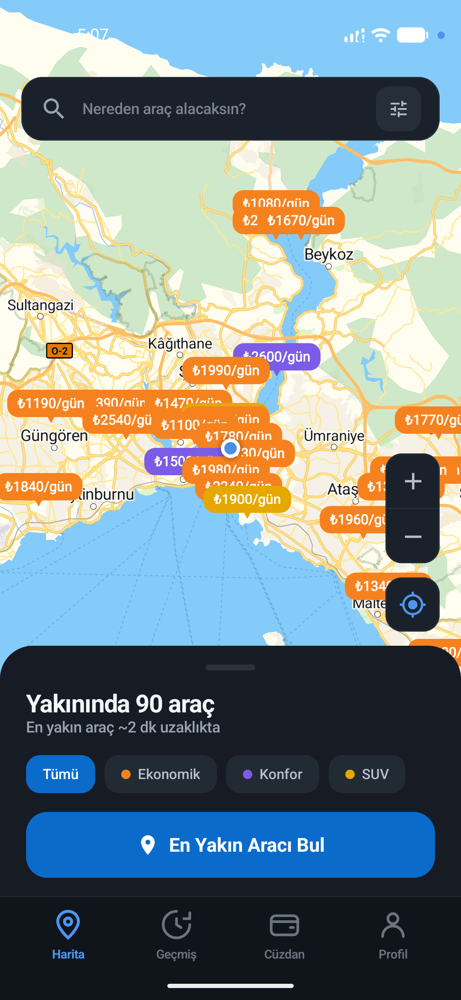 | 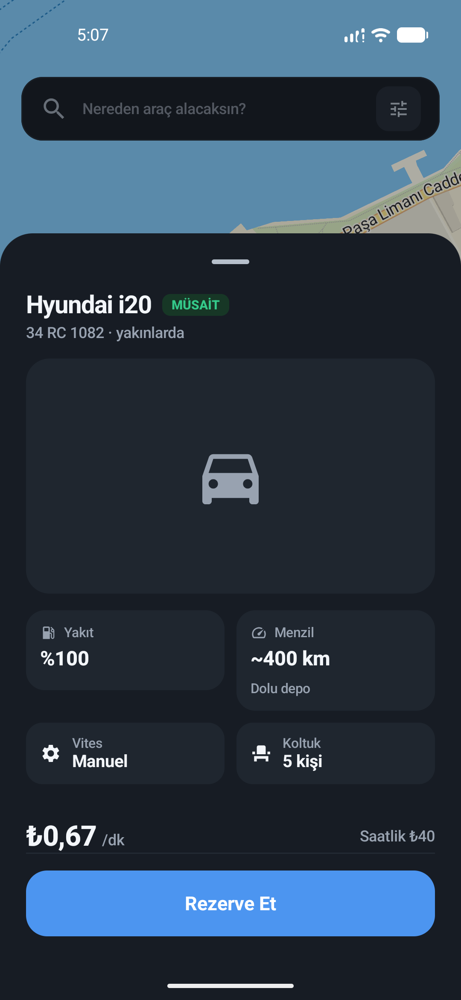 |
| `GET /vehicles` ile çekilen araçlar kategoriye göre renkli fiyat etiketleriyle (Ekonomik turuncu, Konfor mor, SUV altın) haritada gösterilir. Alt sheet "Yakınında N araç" sayısını gösterir; bu sayı hem görünür harita alanına hem 5 km yarıçapına göre hesaplanır. | Bir araç işaretine dokunulunca açılan bottom sheet; yakıt, menzil, vites ve koltuk bilgisiyle birlikte dakikalık/saatlik fiyatı gösterir. "Rezerve Et" Rezervasyon ekranına geçer. |

| Rezervasyon Onayı |
| :---: |
| 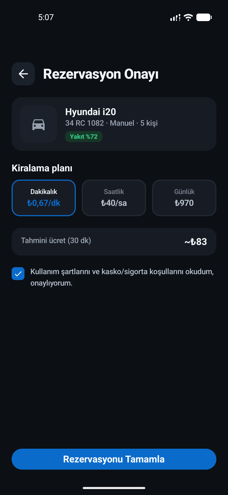 |
| Kullanıcı Dakikalık / Saatlik / Günlük plan seçer, tahmini ücreti görür ve kullanım şartlarını onaylar. "Rezervasyonu Tamamla" önce `reservationRepository.reserveVehicle()`, ardından `rentalRepository.createRental()` çağırır ve Araç Durumu (BEFORE) ekranına yönlendirir. |

### 2.4. Kiralama Akışı — Sürüş Öncesi Kontrol → Aktif Yolculuk → Teslim

Kiralamanın gerçek yaşam döngüsü: `PREPARING` → `ACTIVE` → `COMPLETED`. Sürüş öncesi ve sonrası 4 yönlü araç fotoğrafı zorunludur.

| Araç Durumu (BEFORE) — Başlangıç | Fotoğraf Kaynağı Seçimi |
| :---: | :---: |
| 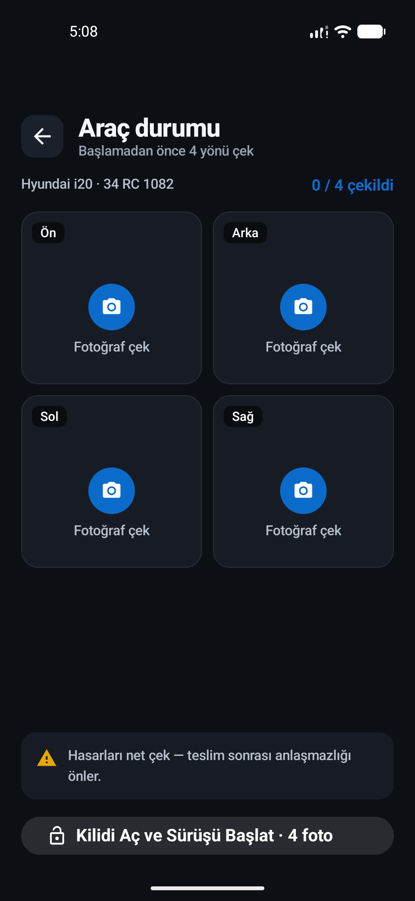 | 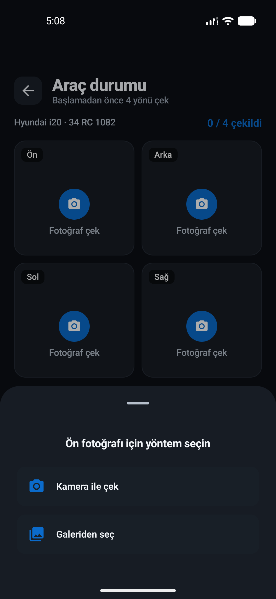 |
| Ön/Arka/Sol/Sağ olmak üzere 4 fotoğraf tamamlanmadan `startRental()` 409 döner. Geri tuşu (hem ekrandaki ok hem donanım tuşu) bu ekranda `PREPARING` durumundaki kiralamayı `cancelPreparingRental` ile gerçekten iptal ediyor. | Ehliyet doğrulamasındaki foto deseninin ortak bileşene çıkarılmış hali; kamera veya galeriden seçim yapılabilir. Seçilen görsel `PhotoCaptured` intent'iyle ViewModel'e akar ve BEFORE modunda sunucuya (`POST /rentals/{id}/photos`) yüklenir. |

| 4/4 Tamamlandı | Aktif Yolculuk |
| :---: | :---: |
| 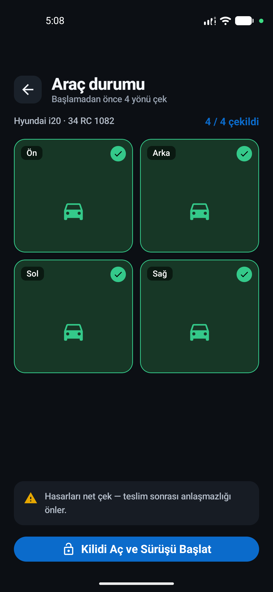 | 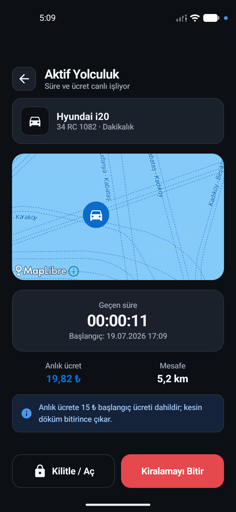 |
| Dört yön de yüklendiğinde buton "Kilidi Aç ve Sürüşü Başlat" olarak aktifleşir; tıklanınca `rentalRepository.startRental()` çağrılır ve rental `PREPARING`'den `ACTIVE`'e geçer. | Süre yerel bir Tick ile saniyede bir akar; anlık ücret ve mesafe ise `GET /rentals/active` üzerinden 5 saniyede bir sunucudan tazelenir. Aracın canlı konumu Socket.IO ile MapLibre üzerinde gösterilir. Ekran açılırken `rental.status`'un gerçekten `ACTIVE` olduğu doğrulanıyor — değilse kullanıcı sahte bir "aktif sürüş" yerine Araç Durumu (BEFORE) ekranına geri yönlendiriliyor. |

| Araç Kilitli / Kilidi Aç | Araç Durumu (AFTER) — Teslim |
| :---: | :---: |
| 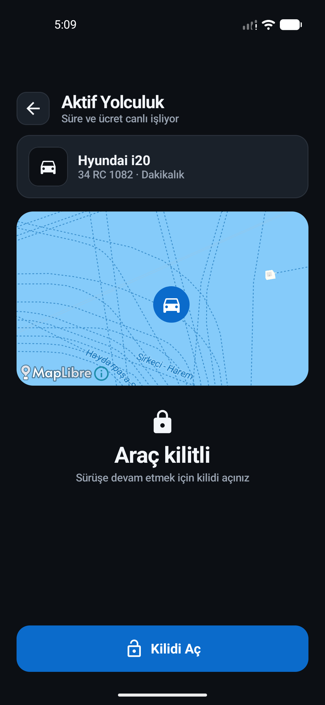 | 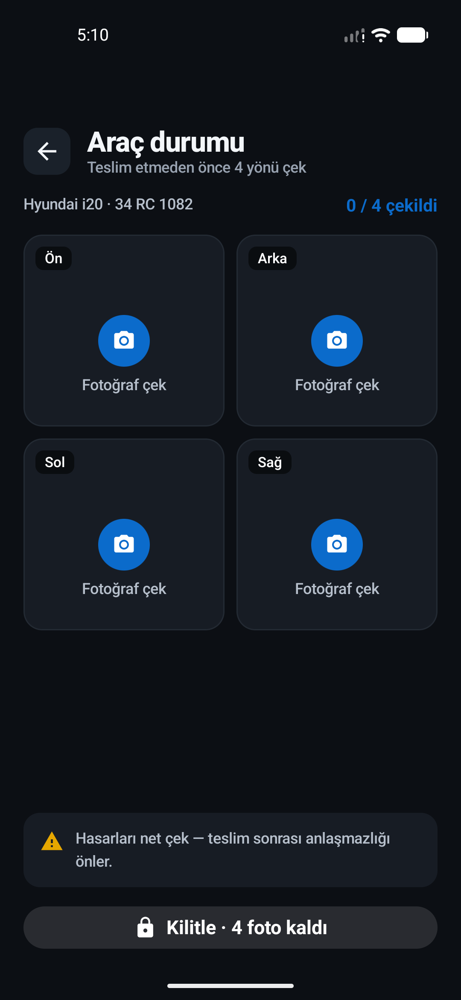 |
| "Kilitle / Aç" geçici bir yerel UI durumu — backend'de karşılığı olan ayrı bir uç nokta yok, yalnızca sayaç durmadan ekranı değiştiriyor. | "Kiralamayı Bitir" aslında bitirme API'sini çağırmaz; kullanıcıyı bu teslim-sonrası foto ekranına yönlendirir. AFTER modundaki fotoğraflar için API v2'de bir yükleme ucu yok — çekim yalnızca yerel kontrol listesini işaretler. |

| Teslim Fotoğrafları Tamamlandı |
| :---: |
| 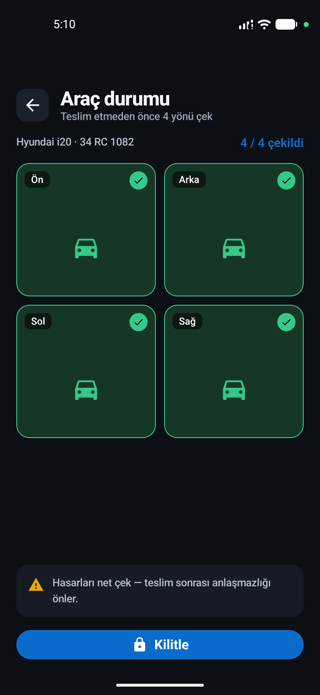 |
| 4/4 tamamlanınca "Kilitle" butonu gerçek bitirme çağrısını tetikler: plan `DAILY` ise `returnVehicle()`, değilse `finishRental()` — rental `ACTIVE`'den `COMPLETED`'e geçer ve ücret dökümü kilitlenir. |

### 2.5. Ödeme — Cüzdan, Kart, İyzico

Kiralama tamamlandığında toplam ücret gösterilir ve Cüzdan, Kart (simüle) veya İyzico (gerçek sandbox checkout, bkz. [Bölüm 3.4](#34-i̇yzico-sandbox-ortak-ödeme-entegrasyonu)) ile ödeme yapılabilir.

| Yolculuk Tamamlandı — Ödeme Yöntemi | Ödeme Onaylandı (Cüzdan) |
| :---: | :---: |
| 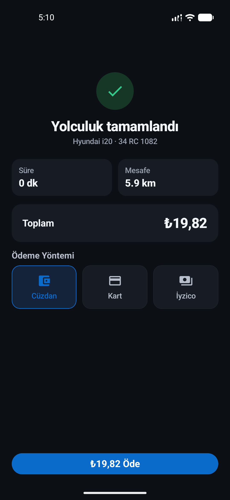 | 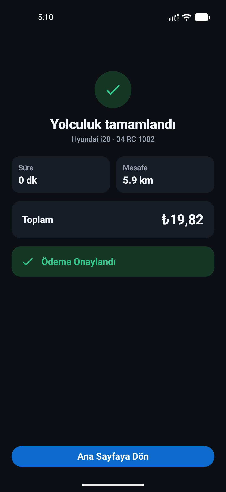 |
| Üç sekmeli ödeme seçici: Cüzdan, Kart, İyzico. Cüzdan seçiliyken "₺19,82 Öde" butonu doğrudan `payRental(WALLET)` çağırır. | `payRental` başarılı olduğunda `isPaid=true` olur ve yeşil "Ödeme Onaylandı" rozeti görünür. "Ana Sayfaya Dön" nav yığınını (`popUpTo(0)`) tamamen temizler. |

| Yöntem: İyzico | İyzico Checkout Formu |
| :---: | :---: |
| 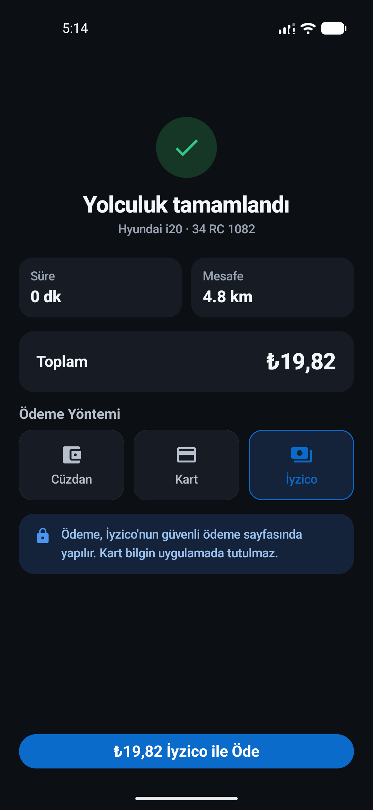 | 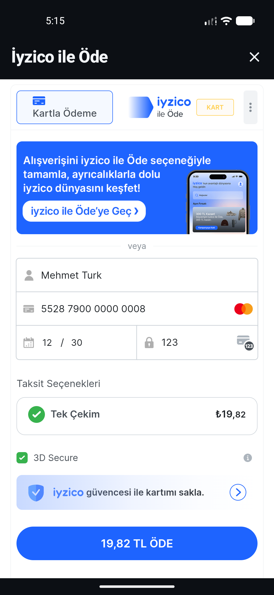 |
| İyzico seçildiğinde kart bilgisinin hiçbir zaman uygulamaya/backend'e girmediği açıkça belirtiliyor — ödeme İyzico'nun kendi güvenli sayfasında (WebView) yapılıyor. | `checkout-form/initialize`'dan dönen `paymentPageUrl` bir `WebView` içinde açılır; bu, İyzico sandbox ortamının gerçek ödeme sayfasıdır (kart no, SKT, CVC, taksit seçenekleri, 3D Secure). |

| İyzico — Ödeme Başarılı |
| :---: |
| 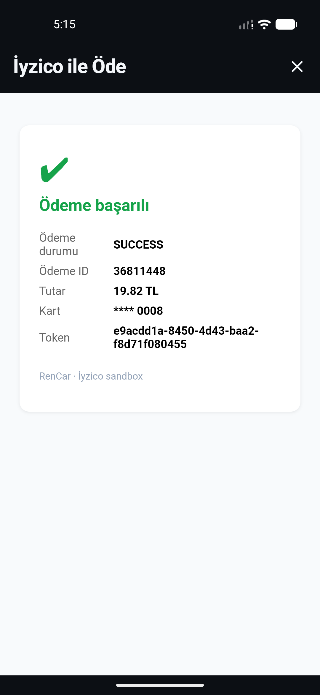 |
| Kullanıcı ödemeyi tamamlayıp kapattığında `checkout-form/result` tek seferlik sorgulanır. Sonuç, iki ayrı ViewModel arasında `SavedStateHandle` yerine Hilt `@Singleton` bir `SharedFlow` (`IyzicoPaymentEventBus`) ile taşınır — bu, önceki bir `SavedStateHandle` denemesinin cihazda güvenilir çalışmadığının tespit edilmesinin ardından alınmış bir mimari karardır. |

### 2.6. Geçmiş, Cüzdan, Profil

Alt navigasyonun kalan üç sekmesi: tamamlanmış kiralamaların dökümü, cüzdan bakiyesi/işlem geçmişi ve hesap bilgileri.

| Kiralamalarım | Kiralama Detayı |
| :---: | :---: |
| 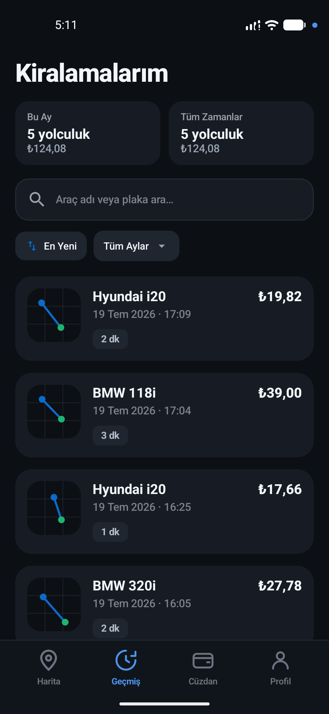 | 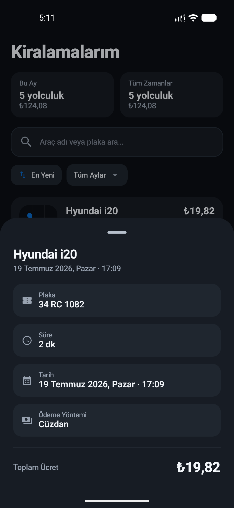 |
| `GET /rentals` içinden yalnızca `status == COMPLETED` olanlar listelenir; bu ay ve tüm zamanlar için toplam yolculuk/harcama özetlenir. Arama ve ay filtresi client-side uygulanır. | Bir kiralamaya dokunulunca açılan bottom sheet; "Ödeme Yöntemi" satırı, backend'in zaten döndürdüğü ama önceden hiç okunmayan `RentalResponseDto.paymentMethod` alanını gösteriyor. |

| Cüzdan | Profil |
| :---: | :---: |
| 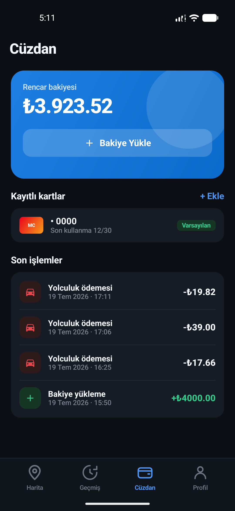 | 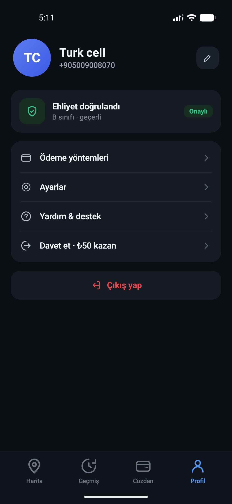 |
| Rencar bakiyesi, kayıtlı kartlar ve "Son işlemler" listesi. Bu liste `GET /wallet`'ın `transactions` dizisinden geliyor ve yalnızca cüzdan bakiyesini etkileyen hareketleri (bakiye yükleme, cüzdanla ödeme) içeriyor — kart/İyzico ile ödemeler burada değil, Kiralamalarım'da görünür. | Kullanıcı adı/telefonu, ehliyet onay rozeti ("B sınıfı · geçerli"), ödeme yöntemleri, ayarlar ve çıkış yap. Ehliyet rozeti, önceki bölümdeki AI onay akışının sonucunu yansıtıyor. |

| Yeni Kart Ekle | Bakiye Yükle |
| :---: | :---: |
| 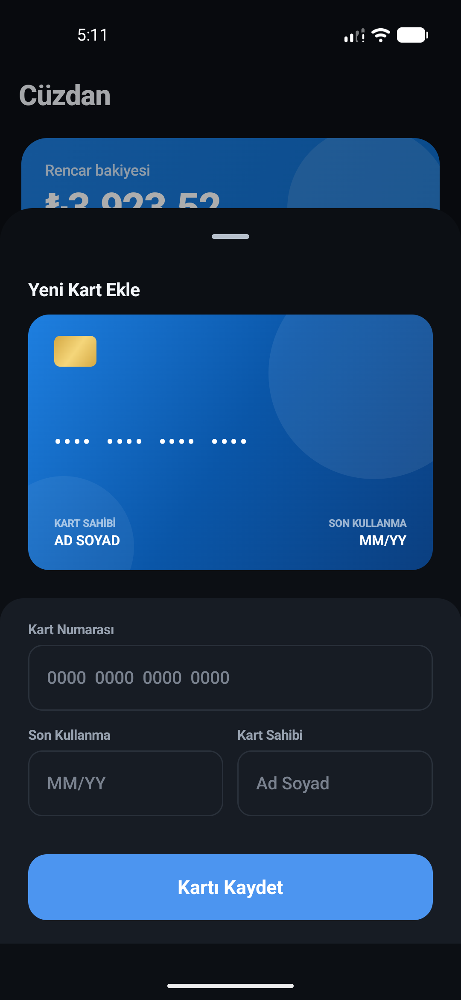 | 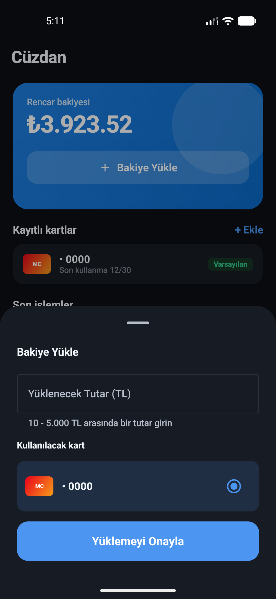 |
| Kart numarası, SKT ve kart sahibi bilgisiyle simüle bir kart kaydı formu; üstte canlı bir kart önizlemesi gösterilir. | 10-5.000 TL aralığında bir tutar girilip kayıtlı bir kart seçilir. |

---

## 3. Detaylı Teknik Özellikler ve Gelişmiş Mimari

### 3.1. On-Device Yapay Zeka ile Yüz Doğrulama (Face Matching AI Pipeline)

Cihaz üzerinde, harici bir sunucu bağımlılığı olmadan çalışan yüz tanıma ve doğrulama akışı, [`util/FaceMatcher.kt`](https://github.com/melikesukocyigit/Rencar-pair/blob/main/app/src/main/java/com/turkcell/rencar_pair/util/FaceMatcher.kt) dosyasında uygulanmıştır:

```
[Ehliyet Ön Yüzü / Selfie]
        │
        ▼ (Google ML Kit)
[Yüz Tespiti ve Koordinat Kırpma]
        │
        ▼ (Ölçeklendirme: 112x112 & Normalizasyon)
[TensorFlow Lite (MobileFaceNet)]
        │
        ▼ (128 Boyutlu Öznitelik Vektörleri)
[Kosinüs Benzerliği Hesaplama] ─── (Benzerlik Skoru >= 0.70) ───► [Demo Admin Onayı Tetikleme]
```

* **Yüz Algılama ve Kırpma (Google ML Kit):**
  Kullanıcının yüklediği Ehliyet Ön Yüz görseli ile kameradan çekilen anlık Selfie görseli `com.google.mlkit:face-detection` kütüphanesi tarafından taranır. Yüz alanlarının sınır koordinatları (`Bounding Box`) tespit edilerek görsellerden yalnızca yüz kısımları kırpılır (`Bitmap.createBitmap`).
* **Ön İşleme ve Normalizasyon:**
  Kırpılan yüz resimleri, TensorFlow Lite modelinin girdi formatına uyumlu olması için **112x112 piksel** boyutlarına ölçeklendirilir. Piksel renk değerleri (RGB) normalize edilerek `ByteBuffer` içerisine `Float` tipinde `[-1, 1]` aralığında yazılır.
* **Öznitelik Vektörü Üretimi (MobileFaceNet):**
  Ön işleme tabi tutulan veri, projeye dahil edilen `mobile_facenet.tflite` model dosyası aracılığıyla çalıştırılır (`Interpreter.run`). Model, girdi bitmap'ini yüzün ayırt edici karakteristik özelliklerini temsil eden **128 boyutlu sayısal bir vektöre (embedding)** dönüştürür.
* **Kosinüs Benzerliği Matematiksel Analizi:**
  İki adet 128 boyutlu vektör ($A$ ve $B$) arasındaki benzerlik, Kosinüs Benzerliği formülü ile hesaplanır:
  $$\text{Benzerlik} = \frac{A \cdot B}{\|A\| \|B\|}$$
  Bu değer `0.70` (eşik değer) veya üzerindeyse yüzlerin aynı kişiye ait olduğu doğrulanır.
* **Otomatik Demo Yetki Yükseltme Akışı (Bilinçli Kısayol):**
  Sunum esnasında jüriye hızlı ve kesintisiz bir deneyim sunabilmek amacıyla, yüz eşleşmesi başarılı olduğunda uygulama arka planda sabit bir demo yönetici hesabı (`ADMIN_PHONE` ve `ADMIN_OTP`, bkz. [`AdminApprovalRepository.kt`](https://github.com/melikesukocyigit/Rencar-pair/blob/main/app/src/main/java/com/turkcell/rencar_pair/data/repository/AdminApprovalRepository.kt)) ile sisteme giriş yapar. Elde ettiği yönetici JWT token'ı ile `/admin/licenses/{id}/approve` API servisini tetikler ve kullanıcının durumunu anında `APPROVED` durumuna geçirerek rolünü `CUSTOMER` yapar. Hemen ardından `refreshSession()` çağrılarak kullanıcının token'ı güncellenir.

### 3.2. Canlı Konum ve Soket Entegrasyonu (Socket.IO & Linear Interpolation)

* **Websocket Konum Akışı (`RideLocationClient`):**
  Yolculuk aktif olduğunda, Socket.IO kütüphanesi ile `/ws/locations` namespace'ine bağlanılır. Sunucu, kullanıcının aktif kiralama bilgisine göre ilgili araca ait anlık konum koordinatlarını `my-vehicle` event'i ile yayınlar. Bu akış, Kotlin Coroutines `callbackFlow` mimarisi ile toplanarak UI katmanına `Flow<VehicleLocationPoint>` olarak aktarılır.
* **Yumuşak Araç Hareketi (Linear Interpolation - Lerp):**
  Soket üzerinden gelen yeni konum koordinatları (~1 saniye aralıklarla), harita üzerindeki araba marker'ının (özel `ic_car` ikonu) harita üzerinde sıçrayarak (ışınlanarak) hareket etmesine neden olur. Bu durumu engellemek ve yumuşak bir ilerleme sağlamak için doğrusal enterpolasyon algoritması uygulanmıştır:
  $$x_{\text{yeni}} = x_{\text{eski}} + (x_{\text{hedef}} - x_{\text{eski}}) \times t$$
  Her yeni konum güncellemesinde, marker eski konumundan yeni konuma 1 saniyelik bir süre içerisinde, 40ms aralıklarla (toplam 24 adımda) adım adım kaydırılır (`MapLibreMap.updateMarker`).

### 3.3. Gelişmiş Harita ve Konum Yönetimi (MapLibre SDK)

* **Dinamik Görünüm Alanı Sayaç Kontrolü:**
  Kullanıcı haritada gezinirken, MapLibre projeksiyon sınırları (`MapLibreMap.projection.visibleRegion.latLngBounds`) her kamera hareketinde (`HomeIntent.MapBoundsChanged`) [`HomeViewModel.kt`](https://github.com/melikesukocyigit/Rencar-pair/blob/main/app/src/main/java/com/turkcell/rencar_pair/ui/home/HomeViewModel.kt) dosyasına aktarılır. ViewModel, o an ekranda görünen coğrafi sınırlar içerisindeki müsait araçları dinamik olarak filtreleyerek sayacı günceller.
* **5 km Yarıçap Koruma Kalkanı (OR Modu):**
  Kullanıcı "Konumuma Git" butonuna bastığında harita çok yakın bir yakınlaştırma (`zoom = 15`) seviyesine odaklanır. Bu dar alanda o an araç bulunmaması durumunda sayacın yanıltıcı şekilde "0 araç" göstermesini önlemek amacıyla; sayaç **haritada görünen alan VEYA kullanıcının GPS konumunun 5 km yarıçapındaki** tüm araçları toplayarak hesaplama yapar (Haversine formülü kullanılarak). Bu mantığın sınır durumları [`HomeUiStateTest.kt`](https://github.com/melikesukocyigit/Rencar-pair/blob/main/app/src/test/java/com/turkcell/rencar_pair/ui/home/HomeUiStateTest.kt) içinde birim testleriyle doğrulanmıştır.
* **Arka Plan Araç Sayfalama (Pagination):**
  Haritada varsayılan ilk sayfa sınırı (20 araç) aşılarak, ilk yüklemenin ardından sunucudaki tüm müsait araçlar (140+) arka planda sayfa sayfa sessizce taranarak harita üzerine yerleştirilir.

### 3.4. İyzico Sandbox Ortak Ödeme Entegrasyonu

* **WebView Tabanlı Ödeme Akışı:**
  Ödeme yöntemi olarak "İyzico" seçildiğinde, kart verileri istemci tarafında tutulmadan `/iyzico/checkout-form/initialize` API uç noktası çağrılarak bir İyzico Sandbox ödeme token'ı ve `paymentPageUrl` üretilir. Kullanıcı bu adresi native bir `WebView` içinde açar ve İyzico güvenli sayfası üzerinde 3DS doğrulaması dahil ödemeyi tamamlar.
* **Event Bus Tabanlı Ekranlar Arası Haberleşme (`IyzicoPaymentEventBus`):**
  Android'in geleneksel `SavedStateHandle` mimarisi, farklı navigasyon yığınları (backstack entries) arasında karmaşık veri geçişlerinde kararsız çalışabilmektedir. Bu projede, ödeme tamamlanıp WebView ekranı kapatıldığında TripSummary ekranına ödeme sonucunu bildirmek için Hilt `@Singleton` kapsamlı, Kotlin `SharedFlow` tabanlı merkezi bir `IyzicoPaymentEventBus` yapısı kurulmuştur.

---

## 4. Mimari ve Sunum Katmanı (MVI Deseni)

Proje, Sunum katmanında **MVI (Model-View-Intent)** ve **UDF (Unidirectional Data Flow)** prensiplerini benimser. Bu sayede ekran durumları tek bir kaynaktan yönetilir ve öngörülebilir hale gelir:

```
[UI/Screen] ───(Intent / Kullanıcı Aksiyonu)───► [ViewModel]
     ▲                                                │
     │                                                ▼ (Repository / Network)
[UI State / Effect] ◄────────(Yeni State)──────── [Veri Katmanı]
```

* **State (Durum):** Ekranın o anki görsel durumunu temsil eden tekil veri nesnesi (örn. `HomeUiState`).
* **Intent (Niyet):** Kullanıcının tetiklediği tüm aksiyonlar (örn. `HomeIntent.SelectVehicleCategory`).
* **Effect (Yan Etki):** Navigasyon veya Snackbar gösterme gibi tek seferlik olayları temsil eden asenkron akış (örn. `HomeEffect.NavigateToActiveRental`).
* **Repository Pattern:** Her veri kaynağı `Repository` arayüzü ve `RepositoryImpl` uygulaması olarak ikiye ayrılmıştır (örn. [`AuthRepositoryImpl.kt`](https://github.com/melikesukocyigit/Rencar-pair/blob/main/app/src/main/java/com/turkcell/rencar_pair/data/repository/AuthRepositoryImpl.kt)), böylece ViewModel'ler somut implementasyona değil soyutlamaya bağımlı olur.

---

## 5. Kod Kalitesi ve Test Standartları

Proje, bir bootcamp projesinin ötesinde, gerçek üretim pratiklerini yansıtan kapsamlı bir test altyapısına sahiptir: **23 test dosyası** içinde toplam **120 test fonksiyonu** (70 birim testi + 50 UI testi) bulunmaktadır.

### 5.1. Birim Testleri (Unit Tests)

`app/src/test` altında **7 UiState test dosyası**, aşağıdaki ekranların durum mantığını doğrular:

| Test Dosyası | Kapsadığı Ekran |
| :--- | :--- |
| [`HomeUiStateTest.kt`](https://github.com/melikesukocyigit/Rencar-pair/blob/main/app/src/test/java/com/turkcell/rencar_pair/ui/home/HomeUiStateTest.kt) | Harita / Ana Ekran  |
| [`HistoryUiStateTest.kt`](https://github.com/melikesukocyigit/Rencar-pair/blob/main/app/src/test/java/com/turkcell/rencar_pair/ui/history/HistoryUiStateTest.kt) | Kiralama Geçmişi  |
| [`ActiveRentalUiStateTest.kt`](https://github.com/melikesukocyigit/Rencar-pair/blob/main/app/src/test/java/com/turkcell/rencar_pair/ui/activerental/ActiveRentalUiStateTest.kt) | Aktif Yolculuk Paneli |
| [`VehicleConditionUiStateTest.kt`](https://github.com/melikesukocyigit/Rencar-pair/blob/main/app/src/test/java/com/turkcell/rencar_pair/ui/vehiclecondition/VehicleConditionUiStateTest.kt) | Araç Teslim/Alım Fotoğrafları |
| [`ReservationUiStateTest.kt`](https://github.com/melikesukocyigit/Rencar-pair/blob/main/app/src/test/java/com/turkcell/rencar_pair/ui/reservation/ReservationUiStateTest.kt) | Rezervasyon Akışı |
| [`OtpUiStateTest.kt`](https://github.com/melikesukocyigit/Rencar-pair/blob/main/app/src/test/java/com/turkcell/rencar_pair/ui/auth/otp/OtpUiStateTest.kt) | OTP Doğrulama |
| [`RegisterUiStateTest.kt`](https://github.com/melikesukocyigit/Rencar-pair/blob/main/app/src/test/java/com/turkcell/rencar_pair/ui/auth/register/RegisterUiStateTest.kt) | Kayıt Ol Akışı |

Bu testler yalnızca "mutlu senaryo" değil, gerçek kullanıcı hatalarına yol açabilecek sınır durumlarını da kapsar: 5 km yarıçap sınırında tam eşitlik durumu, boş araç listesi, en yakın aracın doğru seçilip seçilmediği, ay/arama filtresi kombinasyonları gibi.

### 5.2. Arayüz (Compose UI) Testleri

`app/src/androidTest` altında **16 dosyada 50 test fonksiyonu**, gerçek kullanıcı etkileşimlerini `createComposeRule` ile simüle eder — buton tıklamaları, metin girişleri ve bunların doğru `Intent`/navigasyon callback'ini tetikleyip tetiklemediği doğrulanır. Neredeyse uygulamanın tüm ekranları kapsanmıştır: Ana Ekran (Harita), Giriş, Kayıt, OTP, Ehliyet, Onboarding, Splash, Profil, Cüzdan, Rezervasyon, Aktif Kiralama, Araç Durumu, Yolculuk Özeti, Ödeme (İyzico Checkout) ve Kiralama Geçmişi.

Örnek olarak [`HomeScreenTest.kt`](https://github.com/melikesukocyigit/Rencar-pair/blob/main/app/src/androidTest/java/com/turkcell/rencar_pair/ui/home/HomeScreenTest.kt), arama kutusuna yazı girildiğinde doğru `SearchQueryChanged` intent'inin tetiklendiğini, filtre çiplerine ve yakınlaştırma/uzaklaştırma butonlarına tıklamanın doğru callback'leri çağırdığını ve aktif kiralama bannerine tıklandığında doğru ekrana yönlendirme yapıldığını test eder.

### 5.3. Diğer Kalite Standartları

* **Backend Kısıtlarına Karşı Dayanıklı Tasarım:**
  [`HomeViewModel.kt`](https://github.com/melikesukocyigit/Rencar-pair/blob/main/app/src/main/java/com/turkcell/rencar_pair/ui/home/HomeViewModel.kt) içindeki yorumlar, ekibin gerçek bir backend sorunuyla (`/rentals` endpoint'inin 500 hatası döndürmesi) karşılaştığını ve bunu `/rentals/active` endpoint'ine geçerek çözdüğünü gösteriyor. Bu tür kararlar kod içinde gerekçeleriyle belgelenmiştir, kod yalnızca "ne yaptığını" değil "neden öyle yaptığını" da anlatır.
* **Güvenli Yapılandırma Yönetimi:**
  Harita servis anahtarı (`MAPTILER_API_KEY`) gibi hassas değerler koda gömülü değildir; `local.properties` üzerinden `BuildConfig` alanlarına aktarılır. Bu, statik kod analizinde anahtar sızıntısı riskini ortadan kaldırır.
* **Bilinçli Teknik Kısayolların Şeffaf Belgelenmesi:**
  Demo admin onay akışında kullanılan sabit `ADMIN_PHONE` / `ADMIN_OTP` değerleri gibi bilinçli kısayollar, kod içinde ve dokümantasyonda açıkça "demo amaçlı" olarak işaretlenmiştir; gizlenmemiştir. Bu, ekibin üretim/demo ayrımının farkında olduğunu ve teknik borcu şeffaf şekilde yönettiğini gösterir.
* **Ölçeklenebilir Veri Yükleme:**
  Harita ekranı, kullanıcıyı beklemeden önce ilk 20 aracı gösterip kalan 140+ aracı arka planda sayfa sayfa (pagination) sessizce yükler; bu da büyük veri setlerinde bile akıcı bir kullanıcı deneyimi sağlar.
* **Çift Tema Tutarlılığı:**
  Açık ve Koyu Tema, uygulamanın tüm ekranlarında (harita, ödeme, cüzdan, geçmiş dahil) tutarlı şekilde uygulanmıştır; bu, `ui/theme/` katmanında merkezi bir tasarım sistemi ile yönetilir.

---

## 6. Teknoloji Yığını (Tech Stack)

* **UI & Arayüz:** Jetpack Compose, Material 3, Lottie (Animasyonlar), Glide.
* **Bağımlılık Enjeksiyonu (DI):** Hilt (Dagger-Hilt) & KSP.
* **Ağ & Ağ İstekleri:** Retrofit 2, OkHttp 3, Kotlinx Serialization.
* **Asenkron Programlama:** Kotlin Coroutines & Flow (StateFlow, SharedFlow, callbackFlow).
* **Gerçek Zamanlı İletişim:** Socket.IO Client Java.
* **Harita Alt Yapısı:** MapLibre SDK, MapLibre Android Jetpack Compose.
* **Yapay Zeka ve Makine Öğrenimi:** Google ML Kit Face Detection, TensorFlow Lite Android.
* **Test:** JUnit4 birim testleri (7 dosya, 70 test) ve Jetpack Compose UI testleri / `createComposeRule` (16 dosya, 50 test) — bkz. [Kod Kalitesi ve Test Standartları](#5-kod-kalitesi-ve-test-standartları).

---

## 7. Proje Dizin Yapısı

```
com.turkcell.rencar_pair/
│
├── data/
│   ├── local/          # SharedPreferences, TokenManager
│   ├── model/          # DTOs (Auth, Vehicle, Rental, Wallet, License, Iyzico, Reservation)
│   ├── payment/        # IyzicoPaymentEventBus
│   ├── remote/         # Retrofit APIs (AuthService, VehicleService, RentalService, vb.)
│   └── repository/     # Repositories (Auth, Vehicle, Rental, Wallet, License, Iyzico, Reservation)
│
├── di/                 # Hilt DI Modülleri (NetworkModule, WalletModule, IyzicoModule, vb.)
│
├── ui/
│   ├── activerental/   # Aktif kiralama harita ekranı ve canlı sayaçlar
│   ├── auth/           # Login, OTP, Register, License (Ehliyet & Selfie) ekranları
│   ├── common/         # Harita markerları ve ortak kamera/resim yardımcıları
│   ├── history/        # Kiralama geçmişi listesi
│   ├── home/           # Harita ana ekranı ve araç detay/rezervasyon akışı
│   ├── navigation/     # RencarNavHost, bottom navigation ve rotalar
│   ├── payment/        # Iyzico Checkout WebView ekranı
│   ├── profile/        # Profil ve ehliyet durum göstergesi
│   ├── theme/          # Renk, Yazı Tipi (Sora & Plus Jakarta Sans) ve Tema tanımları
│   ├── tripsummary/    # Yolculuk sonu ücret dökümü ve ödeme yöntemi ekranı
│   └── wallet/         # Cüzdan, bakiye yükleme ve kayıtlı kartlar ekranı
│
└── util/               # Yerel AI yüz eşleştirme (FaceMatcher) ve tarih yardımcıları
```

---

## 8. API ve Veri Katmanı Eşleştirmesi

Uygulamadaki tüm iş akışlarının arka planda hangi Retrofit servisleri ve Repository sınıfları üzerinden yönetildiği aşağıdaki tabloda gösterilmiştir:

| Uç Nokta (Endpoint) | HTTP Metodu | Retrofit Servisi | Repository Sınıfı | Kullanıldığı Ekran / Akış |
| :--- | :---: | :--- | :--- | :--- |
| `/auth/login` | `POST` | `AuthService` | `AuthRepository` | Giriş (Telefon No Gönderimi) |
| `/auth/verify-otp` | `POST` | `AuthService` | `AuthRepository` | OTP Doğrulama |
| `/auth/refresh` | `POST` | `AuthService` | `AuthRepository` | Token Yenileme (Sessiz) |
| `/auth/me` | `GET` | `AuthService` | `AuthRepository` | Profil Ekranı |
| `/license/upload` | `POST` | `LicenseService` | `LicenseRepository` | Ehliyet & Selfie Yükleme |
| `/license/status` | `GET` | `LicenseService` | `LicenseRepository` | Ehliyet Onay Durumu |
| `/admin/licenses/{id}/approve` | `PATCH` | `AdminApprovalService` | `AdminApprovalRepository` | AI ile Anında Onay Akışı |
| `/vehicles` | `GET` | `VehicleService` | `VehicleRepository` | Haritada Araç Listeleme |
| `/vehicles/{id}/quote` | `GET` | `VehicleService` | `VehicleRepository` | Rezervasyon Fiyat Önizleme |
| `/reservations` | `POST` | `ReservationService` | `ReservationRepository` | Araç Rezervasyonu Oluşturma |
| `/rentals` | `POST` | `RentalService` | `RentalRepository` | Yolculuk Başlatma (Kilit Açma) |
| `/rentals/active` | `GET` | `RentalService` | `RentalRepository` | Aktif Yolculuk Bilgileri |
| `/rentals/{id}/photos` | `POST` | `RentalService` | `RentalRepository` | Başlangıç/Teslim Fotoğrafları |
| `/rentals/{id}/finish` | `POST` | `RentalService` | `RentalRepository` | Yolculuk Sonlandırma |
| `/iyzico/checkout-form/initialize`| `POST` | `IyzicoService` | `IyzicoRepository` | İyzico Ödeme Başlatma |
| `/wallet` | `GET` | `WalletService` | `WalletRepository` | Cüzdan Bilgisi & Son İşlemler |
| `/cards` | `GET` | `WalletService` | `WalletRepository` | Kayıtlı Kartları Listeleme |

---

## 9. Kurulum ve Çalıştırma

### 9.1. Ön Gereksinimler
* Android Studio (Koala veya daha yeni sürüm)
* JDK 21 — Android Studio'nun kendi JBR'ını (Settings → Build Tools → Gradle → Gradle JDK) kullanmanız önerilir. Gradle 9.3.1 / AGP 9.1.1 bu proje için JDK 21 ile doğrulanmıştır; çok yeni sürümler (JDK 24+) uyumsuzluk çıkarabilir.
* Bilgisayarda çalışan bir Android Emülatör veya hata ayıklama modu açık fiziksel cihaz.

### 9.2. Yapılandırma (`local.properties`)
Projenin kök dizinindeki `local.properties` dosyasına aşağıdaki alanları ekleyin:
```properties
sdk.dir=C\:\\Users\\...\\AppData\\Local\\Android\\Sdk
MAPTILER_API_KEY=kendi-maptiler-anahtarınız
```
`MAPTILER_API_KEY`, [MapTiler](https://www.maptiler.com/)'ın ücretsiz hesabından alınan bir anahtardır ve `app/build.gradle.kts` içinde `BuildConfig` alanına aktarılır; bu anahtar olmadan ana ekrandaki harita hiç yüklenmez. (Backend adresi `local.properties` üzerinden değil, `ApiConfig.kt` içinde sabit olarak tanımlıdır.)

### 9.3. Çalıştırma
1.  Depoyu klonlayın ve Android Studio'da açın:
```bash
   git clone https://github.com/melikesukocyigit/Rencar-pair.git
```
2. `local.properties` dosyasını [9.2](#92-yapılandırma-localproperties) bölümündeki gibi doldurun.
3. Gradle senkronizasyonunun tamamlanmasını bekleyin (**File → Sync Project with Gradle Files**).
4. Bir emülatör veya fiziksel cihaz seçip **Run** tuşuna basın.

---

## 10. Ekip

* Melike Su Koçyiğit
* Mehmet Karabalcı
* Ali Erkin Avcı
