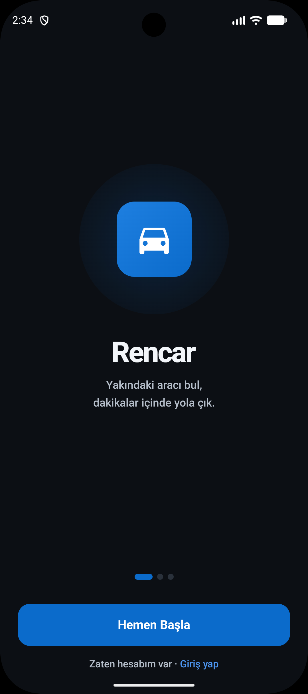
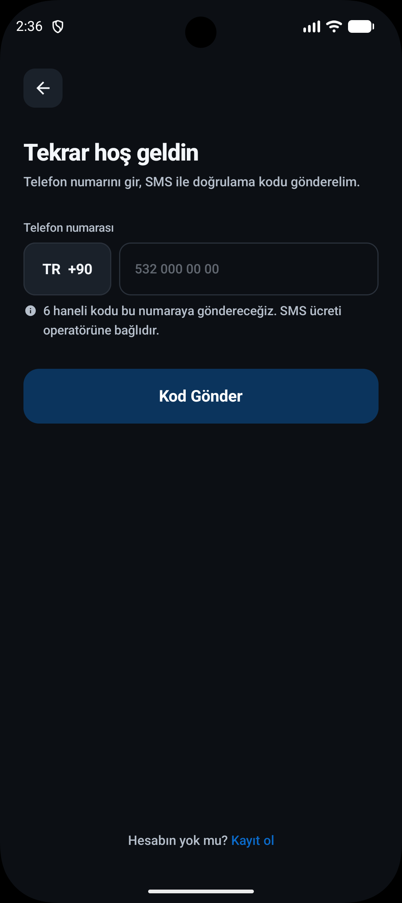
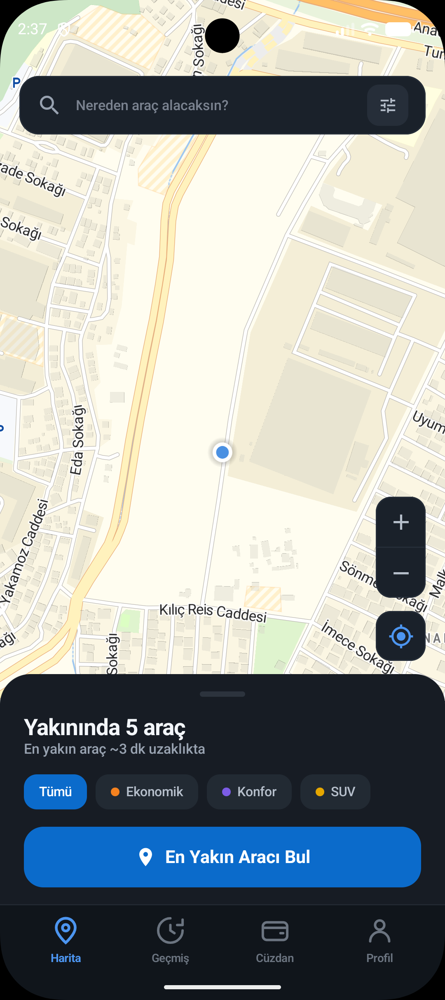
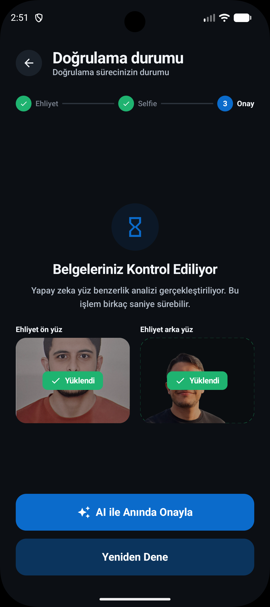
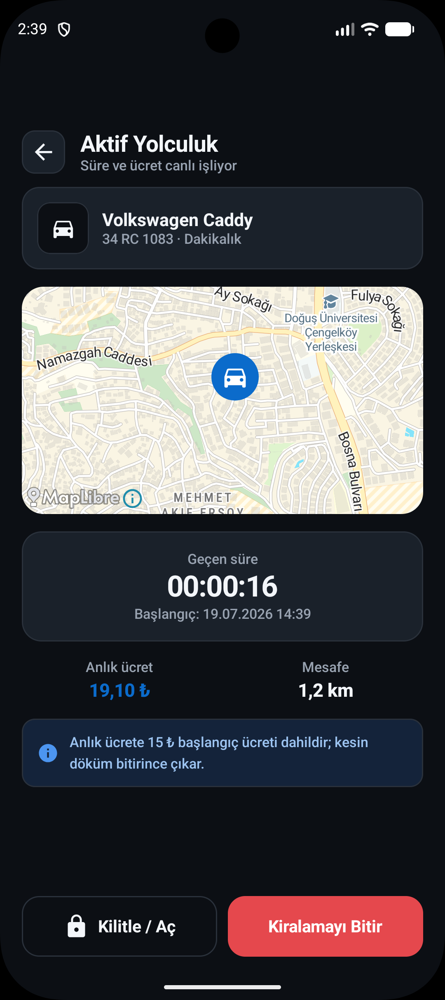
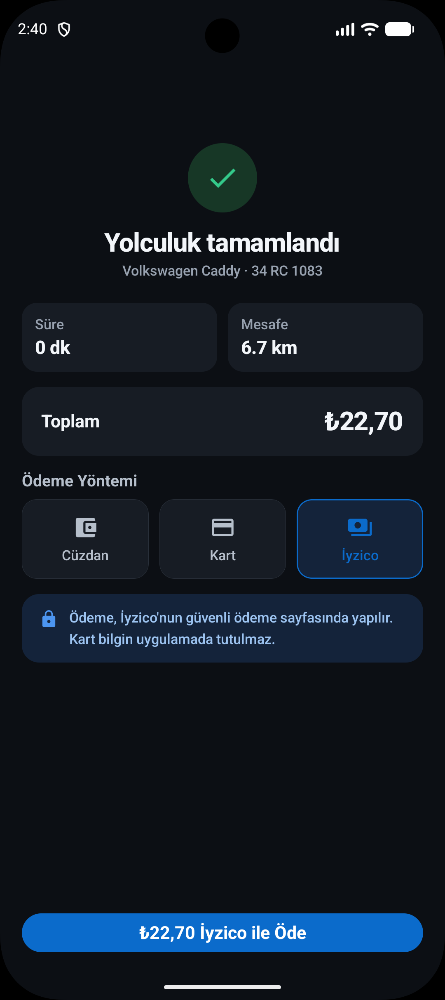

# Rencar - Araç Paylaşım Mobil Uygulaması

Rencar, modern Android mimari standartları ve premium kullanıcı deneyimi vizyonuyla geliştirilmiş, uçtan uca canlı API entegrasyonlarına sahip bir araç paylaşım (car sharing) mobil uygulamasıdır. Proje, Turkcell pair programming ekibi ve jürisine hitap edecek şekilde çift tema (Açık ve Koyu Tema) uyumluluğuyla tasarlanmıştır.

---

## 📸 Ekran Görüntüleri (Screenshots)

*Uygulama içi ekran görüntülerini eklemek veya güncellemek için `docs/images/` dizinine ilgili görselleri yerleştirebilirsiniz.*

| Splash & Onboarding | Giriş & OTP Doğrulama | Ana Harita & Filtreler |
| :---: | :---: | :---: |
|  <br> *Açılış & Tanıtım* |  <br> *Telefon & OTP Girişi* |  <br> *Araç Listesi & Segment Filtreleri* |

| Ehliyet & AI Doğrulama | Aktif Yolculuk Canlı Takip | Yolculuk Özeti & Ödeme |
| :---: | :---: | :---: |
|  <br> *AI Yüz Eşleştirme* |  <br> *Haritada Canlı Takip* |  <br> *Iyzico WebView Ödemesi* |

---

## 🧠 Detaylı Teknik Özellikler ve Gelişmiş Mimari

### 1. On-Device Yapay Zeka ile Yüz Doğrulama (Face Matching AI Pipeline)

Cihaz üzerinde, harici bir sunucu bağımlılığı olmadan çalışan yüz tanıma ve doğrulama akışı aşağıdaki aşamalardan oluşur:

```
[Ehliyet Ön Yüzü / Selfie]
        │
        ▼ (Google ML Kit)
[Yüz Tespiti ve Koordinat Kırpma]
        │
        ▼ (Ölçeklendirme: 112x112 & Normalizasyon)
[TensorFlow Lite (MobileFaceNet)]
        │
        ▼ (128 Boyutlu Öznitelik Vektörleri)
[Kosinüs Benzerliği Hesaplama] ─── (Benzerlik Skoru >= 0.70) ───► [Demo Admin Onayı Tetikleme]
```

* **Yüz Algılama ve Kırpma (Google ML Kit):**
  Kullanıcının yüklediği Ehliyet Ön Yüz görseli ile kameradan çekilen anlık Selfie görseli `com.google.mlkit:face-detection` kütüphanesi tarafından taranır. Yüz alanlarının sınır koordinatları (`Bounding Box`) tespit edilerek görsellerden yalnızca yüz kısımları kırpılır (`Bitmap.createBitmap`).
* **Ön İşleme ve Normalizasyon:**
  Kırpılan yüz resimleri, TensorFlow Lite modelinin girdi formatına uyumlu olması için **112x112 piksel** boyutlarına ölçeklendirilir. Piksel renk değerleri (RGB) normalize edilerek `ByteBuffer` içerisine `Float` tipinde `[-1, 1]` aralığında yazılır.
* **Öznitelik Vektörü Üretimi (MobileFaceNet):**
  Ön işleme tabi tutulan veri, projeye dahil edilen `mobile_facenet.tflite` model dosyası aracılığıyla çalıştırılır (`Interpreter.run`). Model, girdi bitmap'ini yüzün ayırt edici karakteristik özelliklerini temsil eden **128 boyutlu sayısal bir vektöre (embedding)** dönüştürür.
* **Kosinüs Benzerliği Matematiksel Analizi:**
  İki adet 128 boyutlu vektör ($A$ ve $B$) arasındaki benzerlik, Kosinüs Benzerliği formülü ile hesaplanır:
  $$\text{Benzerlik} = \frac{A \cdot B}{\|A\| \|B\|}$$
  Bu değer `0.70` (eşik değer) veya üzerindeyse yüzlerin aynı kişiye ait olduğu doğrulanır.
* **Otomatik Demo Yetki Yükseltme Akışı (Bilinçli Kısayol):**
  Sunum esnasında jüriye hızlı ve kesintisiz bir deneyim sunabilmek amacıyla, yüz eşleşmesi başarılı olduğunda uygulama arka planda sabit bir demo yönetici hesabı (`ADMIN_PHONE` ve `ADMIN_OTP`) ile sisteme giriş yapar. Elde ettiği yönetici JWT token'ı ile `/admin/licenses/{id}/approve` API servisini tetikler ve kullanıcının durumunu anında `APPROVED` durumuna geçirerek rolünü `CUSTOMER` yapar. Hemen ardından `refreshSession()` çağrılarak kullanıcının token'ı güncellenir.

### 2. Canlı Konum ve Soket Entegrasyonu (Socket.IO & Linear Interpolation)

* **Websocket Konum Akışı (`RideLocationClient`):**
  Yolculuk aktif olduğunda, Socket.IO kütüphanesi ile `/ws/locations` namespace'ine bağlanılır. Sunucu, kullanıcının aktif kiralama bilgisine göre ilgili araca ait anlık konum koordinatlarını `my-vehicle` event'i ile yayınlar. Bu akış, Kotlin Coroutines `callbackFlow` mimarisi ile toplanarak UI katmanına `Flow<VehicleLocationPoint>` olarak aktarılır.
* **Yumuşak Araç Hareketi (Linear Interpolation - Lerp):**
  Soket üzerinden gelen yeni konum koordinatları (~1 saniye aralıklarla), harita üzerindeki araba marker'ının (özel `ic_car` ikonu) harita üzerinde sıçrayarak (ışınlanarak) hareket etmesine neden olur. Bu durumu engellemek ve yumuşak bir ilerleme sağlamak için doğrusal enterpolasyon algoritması uygulanmıştır:
  $$x_{\text{yeni}} = x_{\text{eski}} + (x_{\text{hedef}} - x_{\text{eski}}) \times t$$
  Her yeni konum güncellemesinde, marker eski konumundan yeni konuma 1 saniyelik bir süre içerisinde, 40ms aralıklarla (toplam 24 adımda) adım adım kaydırılır (`MapLibreMap.updateMarker`).

### 3. Gelişmiş Harita ve Konum Yönetimi (MapLibre SDK)

* **Dinamik Görünüm Alanı Sayaç Kontrolü:**
  Kullanıcı haritada gezinirken, MapLibre projeksiyon sınırları (`MapLibreMap.projection.visibleRegion.latLngBounds`) her kamera hareketinde (`HomeIntent.MapBoundsChanged`) ViewModel'e aktarılır. ViewModel, o an ekranda görünen coğrafi sınırlar içerisindeki müsait araçları dinamik olarak filtreleyerek sayacı günceller.
* **5km Yarıçap Koruma Kalkanı (OR Modu):**
  Kullanıcı "Konumuma Git" butonuna bastığında harita çok yakın bir yakınlaştırma (`zoom = 15`) seviyesine odaklanır. Bu dar alanda o an araç bulunmaması durumunda sayacın yanıltıcı şekilde "0 araç" göstermesini önlemek amacıyla; sayaç **haritada görünen alan VEYA kullanıcının GPS konumunun 5 km yarıçapındaki** tüm araçları toplayarak hesaplama yapar (Haversine formülü kullanılarak).
* **Arka Plan Araç Sayfalama (Pagination):**
  Haritada varsayılan ilk sayfa sınırı (20 araç) aşılarak, ilk yüklemenin ardından sunucudaki tüm müsait araçlar (140+) arka planda sayfa sayfa sessizce taranarak harita üzerine yerleştirilir.

### 4. İyzico Sandbox Ortak Ödeme Entegrasyonu

* **WebView Tabanlı Ödeme Akışı:**
  Ödeme yöntemi olarak "İyzico" seçildiğinde, kart verileri istemci tarafında tutulmadan `/iyzico/checkout-form/initialize` API uç noktası çağrılarak bir İyzico Sandbox ödeme token'ı ve `paymentPageUrl` üretilir. Kullanıcı bu adresi native bir `WebView` içinde açar ve İyzico güvenli sayfası üzerinde 3DS doğrulaması dahil ödemeyi tamamlar.
* **Event Bus Tabanlı Ekranlar Arası Haberleşme (`IyzicoPaymentEventBus`):**
  Android'in geleneksel `SavedStateHandle` mimarisi, farklı navigasyon yığınları (backstack entries) arasında karmaşık veri geçişlerinde kararsız çalışabilmektedir. Bu projede, ödeme tamamlanıp WebView ekranı kapatıldığında TripSummary ekranına ödeme sonucunu bildirmek için Hilt `@Singleton` kapsamlı, Kotlin `SharedFlow` tabanlı merkezi bir `IyzicoPaymentEventBus` yapısı kurulmuştur.

---

## 📐 Mimari ve Sunum Katmanı (MVI Deseni)

Proje, Sunum katmanında **MVI (Model-View-Intent)** ve **UDF (Unidirectional Data Flow)** prensiplerini benimser. Bu sayede ekran durumları tek bir kaynaktan yönetilir ve öngörülebilir hale gelir:

```
[UI/Screen] ───(Intent / Kullanıcı Aksiyonu)───► [ViewModel]
     ▲                                                │
     │                                                ▼ (Repository / Network)
[UI State / Effect] ◄────────(Yeni State)──────── [Veri Katmanı]
```

* **State (Durum):** Ekranın o anki görsel durumunu temsil eden tekil veri nesnesi (örn. `HomeUiState`).
* **Intent (Niyet):** Kullanıcının tetiklediği tüm aksiyonlar (örn. `HomeIntent.SelectVehicleCategory`).
* **Effect (Yan Etki):** Navigasyon veya Snackbar gösterme gibi tek seferlik olayları temsil eden asenkron akış (örn. `HomeEffect.NavigateToActiveRental`).

---

## 🛠️ Teknoloji Yığıtı (Tech Stack)

* **UI & Arayüz:** Jetpack Compose, Material 3, Lottie (Animasyonlar), Glide.
* **Bağımlılık Enjeksiyonu (DI):** Hilt (Dagger-Hilt) & KSP.
* **Ağ & Ağ İstekleri:** Retrofit 2, OkHttp 3, Kotlinx Serialization.
* **Asenkron Programlama:** Kotlin Coroutines & Flow (StateFlow, SharedFlow, callbackFlow).
* **Gerçek Zamanlı İletişim:** Socket.IO Client Java.
* **Harita Alt Yapısı:** MapLibre SDK, MapLibre Android Jetpack Compose.
* **Yapay Zeka ve Makine Öğrenimi:** Google ML Kit Face Detection, TensorFlow Lite Android.

---

## 📂 Proje Dizin Yapısı

```
com.turkcell.rencar_pair/
│
├── data/
│   ├── local/          # SharedPreferences, TokenManager
│   ├── model/          # DTOs (Auth, Vehicle, Rental, Wallet, License, Iyzico, Reservation)
│   ├── payment/        # IyzicoPaymentEventBus
│   ├── remote/         # Retrofit APIs (AuthService, VehicleService, RentalService, vb.)
│   └── repository/     # Repositories (Auth, Vehicle, Rental, Wallet, License, Iyzico, Reservation)
│
├── di/                 # Hilt DI Modülleri (NetworkModule, WalletModule, IyzicoModule, vb.)
│
├── ui/
│   ├── activerental/   # Aktif kiralama harita ekranı ve canlı sayaçlar
│   ├── auth/           # Login, OTP, Register, License (Ehliyet & Selfie) ekranları
│   ├── common/         # Harita markerları ve ortak kamera/resim yardımcıları
│   ├── history/        # Kiralama geçmişi listesi
│   ├── home/           # Harita ana ekranı ve araç detay/rezervasyon akışı
│   ├── navigation/     # RencarNavHost, bottom navigation ve rotalar
│   ├── payment/        # Iyzico Checkout WebView ekranı
│   ├── profile/        # Profil ve ehliyet durum göstergesi
│   ├── theme/          # Renk, Yazı Tipi (Sora & Plus Jakarta Sans) ve Tema tanımları
│   ├── tripsummary/    # Yolculuk sonu ücret dökümü ve ödeme yöntemi ekranı
│   └── wallet/         # Cüzdan, bakiye yükleme ve kayıtlı kartlar ekranı
│
└── util/               # Yerel AI yüz eşleştirme (FaceMatcher) ve tarih yardımcıları
```

---

## 🔗 API ve Veri Katmanı Eşleştirmesi

Uygulamadaki tüm iş akışlarının arka planda hangi Retrofit servisleri ve Repository sınıfları üzerinden yönetildiği aşağıdaki tabloda gösterilmiştir:

| Uç Nokta (Endpoint) | HTTP Metodu | Retrofit Servisi | Repository Sınıfı | Kullanıldığı Ekran / Akış |
| :--- | :---: | :--- | :--- | :--- |
| `/auth/login` | `POST` | `AuthService` | `AuthRepository` | Giriş (Telefon No Gönderimi) |
| `/auth/verify-otp` | `POST` | `AuthService` | `AuthRepository` | OTP Doğrulama |
| `/auth/refresh` | `POST` | `AuthService` | `AuthRepository` | Token Yenileme (Sessiz) |
| `/auth/me` | `GET` | `AuthService` | `AuthRepository` | Profil Ekranı |
| `/license/upload` | `POST` | `LicenseService` | `LicenseRepository` | Ehliyet & Selfie Yükleme |
| `/license/status` | `GET` | `LicenseService` | `LicenseRepository` | Ehliyet Onay Durumu |
| `/admin/licenses/{id}/approve` | `PATCH` | `AdminApprovalService` | `AdminApprovalRepository` | AI ile Anında Onay Akışı |
| `/vehicles` | `GET` | `VehicleService` | `VehicleRepository` | Haritada Araç Listeleme |
| `/vehicles/{id}/quote` | `GET` | `VehicleService` | `VehicleRepository` | Rezervasyon Fiyat Önizleme |
| `/reservations` | `POST` | `ReservationService` | `ReservationRepository` | Araç Rezervasyonu Oluşturma |
| `/rentals` | `POST` | `RentalService` | `RentalRepository` | Yolculuk Başlatma (Kilit Açma) |
| `/rentals/active` | `GET` | `RentalService` | `RentalRepository` | Aktif Yolculuk Bilgileri |
| `/rentals/{id}/photos` | `POST` | `RentalService` | `RentalRepository` | Başlangıç/Teslim Fotoğrafları |
| `/rentals/{id}/finish` | `POST` | `RentalService` | `RentalRepository` | Yolculuk Sonlandırma |
| `/iyzico/checkout-form/initialize`| `POST` | `IyzicoService` | `IyzicoRepository` | İyzico Ödeme Başlatma |
| `/wallet` | `GET` | `WalletService` | `WalletRepository` | Cüzdan Bilgisi & Son İşlemler |
| `/cards` | `GET` | `WalletService` | `WalletRepository` | Kayıtlı Kartları Listeleme |

---

## 📥 Kurulum ve Çalıştırma

### 1. Ön Gereksinimler
* Android Studio (Koala veya daha yeni sürüm)
* JDK 17
* Bilgisayarda çalışan bir Android Emülatör veya hata ayıklama modu açık fiziksel cihaz.

### 2. Yapılandırma (`local.properties`)
Projenin kök dizinindeki `local.properties` dosyasını açarak API sunucu adresini tanımlayın:
```properties
sdk.dir=C\:\\Users\\...\\AppData\\Local\\Android\\Sdk
# Rencar API v2 Base URL
base.url=https\://rencarv2.halitkalayci.com/
```

### 3. Çalıştırma
1. Android Studio'yu açıp projeyi import edin.
2. Gradle senkronizasyonunun tamamlanmasını bekleyin.
3. Uygulamayı emülatörünüzde (`emulator-5554`) koşturmak için **Run** tuusuna basın.
