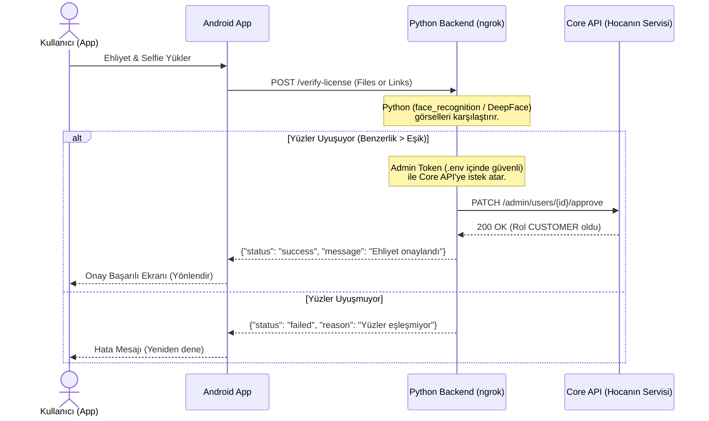

# Rencar - Yüz Eşleştirme (Face Matching) ve Ehliyet Doğrulama - Mimari Analiz ve Planlama

> Bu dosya, özelliğin ilk planlama aşamasında hazırlanan orijinal mimari analiz
> dökümanının değişmeden arşivlenmiş halidir (kaynak:
> `.gemini/antigravity-ide/brain/.../face_matching_architecture_plan.md`).
> Gerçek uygulamada seçilen yöntem, güncel gerekçe ve kod eşlemesi için
> bkz. [`docs/ml-face-matching.md`](./ml-face-matching.md).

Bu döküman, yüz eşleştirme (Face Matching) ve ehliyet doğrulama adımlarının mimari açıdan güvenlik, sürdürülebilirlik ve sunum kalitesi kapsamında değerlendirilmesini içerir.

---

## 1) YÖNTEM KARŞILAŞTIRMASI VE RİSK MATRİSİ

### Yöntem A: Cihaz Üzerinde (Client-Side) Eşleştirme (ML Kit / TFLite)
*Uygulama ehliyet ve selfie resimlerini kendi içinde karşılaştırır ve sonucu API'ye bildirir.*

* 🔴 **Kritik Güvenlik Riski (Admin Token İfşası):** Kullanıcı rolünü `PENDING` durumundan `CUSTOMER` durumuna geçirmek (onaylamak) için bir admin yetkisi gerekecektir. Eğer bu yetki istemci (mobil uygulama) tarafında kullanılırsa, **Admin Token**'ın APK içerisine gömülmesi (hardcoded) gerekir. APK'yı decompile eden herhangi biri bu token'ı saniyeler içinde çalabilir.
* 🔴 **İstemci Tarafı Manipülasyonu (Client-Side Tampering):** Kötü niyetli bir kullanıcı, yüz tarama adımını tamamen bypass edip veya kodu manipüle edip (Frida, Smali editör vb.) doğrudan sunucuya *"Yüz başarıyla eşleşti, bu kullanıcıyı onaylı yetkisine geçir"* isteği atabilir.
* 🟢 **Avantajı:** Çevrimdışı çalışabilirlik, sıfır sunucu maliyeti ve sunum sırasında yerel hız (hızlı tepki).

---

### Yöntem B (Önerilen): Sunucu Üzerinde (Server-Side) Eşleştirme & ngrok Köprüsü
*Mobil uygulama resimleri yükler; karşılaştırma ve onaylama işlemi güvenli bir Python mikroservisinde gerçekleşir.*

* 🟢 **Tam Güvenlik:** Admin Token sadece Python backend üzerindeki `.env` dosyasında saklanır. Mobil uygulamaya asla sızdırılmaz.
* 🟢 **Sıfır Manipülasyon:** Karşılaştırma kararı ve veritabanı güncelleme işlemi tamamen sunucu tarafında (back-channel) kapalı devre gerçekleştiği için istemci (mobil uygulama) doğrulamayı bypass edemez.
* 🟢 **Gelişmiş AI Modelleri:** Python üzerinde `face_recognition` veya `DeepFace` (ResNet-50, FaceNet) gibi çok daha yüksek doğruluğa sahip, endüstri standardı kütüphaneler çalıştırılabilir.
* 🟡 **Dezavantajı:** Sunum sırasında bilgisayarınızda Python servisini ve ngrok tünelini açık tutmanız gerekir.

---

## 2) YÖNTEM B İÇİN UYGULAMA ADIMLARI

### 1. Python Mikroservisi Hazırlanışı (PC)
* **Kütüphaneler:** `FastAPI` (veya Flask), `face_recognition` (dlib tabanlı, %99.38 doğruluk), `requests` (Core API çağrıları için).
* **Akış:**
  1. `/verify-license` endpoint'i yazılır. Girdi olarak `userId`, `selfieImage` ve `licenseImage` alır.
  2. İki resim arasındaki yüz öznitelik vektörleri çıkartılarak aralarındaki mesafe hesaplanır.
  3. Mesafe `0.6` değerinin altındaysa (yani yüzler eşleşiyorsa), Python servisi kendi `.env` dosyasındaki admin token'ı kullanarak Core API'ye istek atar ve kullanıcının durumunu onaylar.

### 2. ngrok Kurulumu
* Python servisi yerelde örneğin `http://127.0.0.1:8000` portunda çalıştırılır.
* `ngrok http 8000` komutuyla dış dünyaya (HTTPS) açılır. Elde edilen `https://xxxx.ngrok-free.app` adresi Android uygulamasında base URL olarak tanımlanır.

### 3. Android Uygulaması Güncellemesi
* `LicenseViewModel` resimleri doğrudan bu ngrok adresine (`POST /verify-license`) gönderir.
* Dönen yanıta göre arayüzde başarılı/başarısız durumları gösterilir.

---

## 3) DEĞERLENDİRME VE ÖNERİ

> [!IMPORTANT]
> **Turkcell Jürisine Sunum Stratejisi:**
> Turkcell gibi kurumsal firmalar, teknik mülakatlarda ve proje sunumlarında **veri güvenliğine ve istemci manipülasyonuna** son derece dikkat ederler.
>
> Sunumda:
> *"İlk başta on-device (ML Kit) planlamıştık ancak istemci tarafında admin yetkilerinin manipüle edilebileceğini ve gizli anahtarların decompile edilerek çalınabileceğini fark ettik. Bu yüzden endüstri standardı olan **Zero-Trust (Sıfır Güven) mimarisine** geçerek doğrulamayı sunucu tarafına (Python + ngrok köprüsü) taşıdık"*
>
> demeniz, projeye profesyonel bir yazılım mimarisi perspektifi katacak ve jüriden çok ciddi artı puan almanızı sağlayacaktır.
