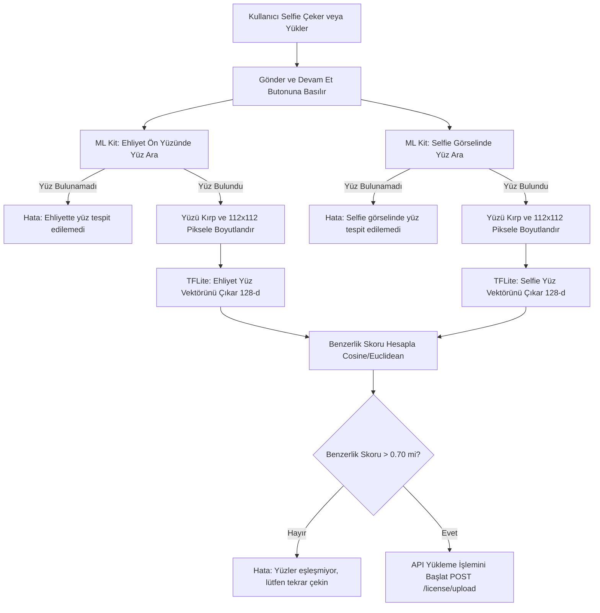

# Rencar - Yerel Yüz Eşleştirme (Face Matching) Özellik Planı

> Bu dosya, özelliğin ilk planlama aşamasında hazırlanan orijinal uygulama
> planı dökümanının değişmeden arşivlenmiş halidir (kaynak:
> `.gemini/antigravity-ide/brain/.../face_matching_plan.md`).
> Gerçek uygulamada (nihai akış, dosya listesi, threshold kalibrasyonu) için
> bkz. [`docs/ml-face-matching.md`](./ml-face-matching.md) — özellikle akışın
> planlanandan farkı: burada tarif edilen "Submit'i engelleyen zorunlu kapı"
> yerine, gerçek uygulamada opsiyonel bir "AI ile Anında Onayla" butonu
> kullanılmıştır (bkz. o dökümandaki §3).

Bu döküman, mobil uygulama üzerinde (on-device) Ehliyet Ön Yüz görselindeki fotoğraf ile kullanıcının çektiği Selfie fotoğrafının yapay zeka yardımıyla karşılaştırılması ve yüz benzerlik analizi gerçekleştirilmesi için hazırlanan teknik planlama dökümanıdır.

---

## 1) TEKNİK MİMARİ VE YÖNTEM

Cihaz üzerinde internet bağımlılığı olmadan, hızlı ve güvenli bir şekilde yüz karşılaştırma işlemi gerçekleştirmek için **Google ML Kit** ve **TensorFlow Lite (TFLite)** teknolojileri birlikte kullanılacaktır:

1. **Yüz Tespiti ve Kırpma (Face Detection & Cropping):**
   - **Google ML Kit Face Detection** kütüphanesi kullanılarak hem Ehliyet Ön Yüz görseli hem de Selfie görseli taranır.
   - Görsellerdeki yüz alanlarının koordinatları tespit edilir ve yüz kısımları görsellerden kırpılarak (`Bitmap.createBitmap`) ayrıştırılır.

2. **Yüz Öznitelik Vektörü Çıkarma (Face Embedding Extraction):**
   - Kırpılan yüz resimleri, TensorFlow Lite yorumlayıcısı (`Interpreter`) aracılığıyla önceden eğitilmiş bir yüz tanıma modeline (**MobileFaceNet** veya **FaceNet**) beslenir.
   - Model girdi olarak aldığı yüz resmini (örneğin 112x112 piksel), yüzün karakteristik özelliklerini temsil eden **128 boyutlu sayısal bir vektöre (embedding)** dönüştürür.

3. **Benzerlik Hesaplama (Similarity Calculation):**
   - Elde edilen iki adet 128 boyutlu vektör arasındaki **Öklid Mesafesi (L2 Euclidean Distance)** veya **Kosinüs Benzerliği (Cosine Similarity)** hesaplanır.
   - Hesaplanan benzerlik skoru belirlenen bir eşik değerinin (threshold, örn. Cosine Similarity > 0.70 veya Euclidean Distance < 0.60) üzerindeyse yüzlerin **aynı kişiye ait olduğu** kabul edilir.

---

## 2) BAĞIMLILIKLAR MATRİSİ

Özelliğin çalışabilmesi için projeye eklenecek kütüphaneler ve eklenme nedenleri aşağıdadır:

| Kütüphane / Bağımlılık | Versiyon | Eklenme Nedeni |
| :--- | :--- | :--- |
| `com.google.mlkit:face-detection` | `16.1.7` | Ehliyet kartı ve selfie görselleri üzerindeki yüz koordinatlarını tespit etmek ve yüzü kırpmak için kullanılır. |
| `org.tensorflow:tensorflow-lite` | `2.14.0` | Cihaz üzerinde TensorFlow Lite formatındaki (.tflite) yüz tanıma modelini koşturmak için kullanılır. |
| `org.tensorflow:tensorflow-lite-support` | `0.4.4` | TFLite modellerine gönderilecek Bitmap görsellerini kolayca ByteBuffer'a dönüştürmek ve normalize etmek için kullanılır. |

---

## 3) DOSYA DÖKÜMÜ

| Değişecek/Eklenecek Dosya | İşlem Türü | Açıklama / Değişiklik Nedeni |
| :--- | :--- | :--- |
| `app/build.gradle.kts` | Değişecek | Yukarıdaki 3 yeni bağımlılık eklenecektir. Ayrıca TFLite model dosyasının APK sıkıştırmasına uğramaması için `aaptOptions` ayarı eklenecektir. |
| `app/src/main/assets/mobile_facenet.tflite` | Eklenecek | Yerel yüz öznitelik vektörü çıkaran önceden eğitilmiş hafif TFLite model dosyası (yaklaşık 4MB-5MB). |
| `app/src/main/java/com/turkcell/rencar_pair/util/FaceMatcher.kt` | Eklenecek | Yüz tespiti, kırpma, TFLite model yorumlama ve kosinüs benzerliği hesaplama işlemlerini gerçekleştiren yardımcı yardımcı sınıf. |
| `ui/auth/license/LicenseViewModel.kt` | Değişecek | Kullanıcı Selfie adımında "Gönder" butonuna bastığında, resimler sunucuya yüklenmeden önce `FaceMatcher` çalıştırılacaktır. Benzerlik testi başarısız olursa sunucuya hiç istek atılmadan yerel hata fırlatılacaktır. |
| `ui/auth/license/LicenseContract.kt` | Değişecek | Arayüze "Yüzler eşleşmiyor" hatasını gösterebilmek için gerekli durum veya etki (Effect) alanları eklenecektir. |

---

## 4) İŞ AKIŞI (WORKFLOW DİYAGRAMI)

---

## 5) SIK KARŞILAŞILAN HATALAR VE ÖNERİLER

- **Bellek Aşımı (Out of Memory):** Görseller yüksek çözünürlüklü olduğunda ML Kit işlemleri bellek sınırını aşabilir. Görseller işlenmeden önce max 1024px genişliğe ölçeklendirilmelidir.
- **Yüz Açısı ve Işık:** Ehliyet üzerindeki resimler genellikle vesikalıktır. Selfie çekilirken kullanıcının düz bakması ve iyi ışık alması konusunda arayüze küçük uyarılar eklenmesi doğruluğu ciddi oranda artırır.
- **Model Sıkıştırma Hatası:** Android build sistemi .tflite uzantılı dosyaları varsayılan olarak sıkıştırır, bu durum çalışma anında okuma hatasına neden olur. `build.gradle.kts` içerisinde `noCompress("tflite")` kuralının eklenmesi kritik önem taşımaktadır.
