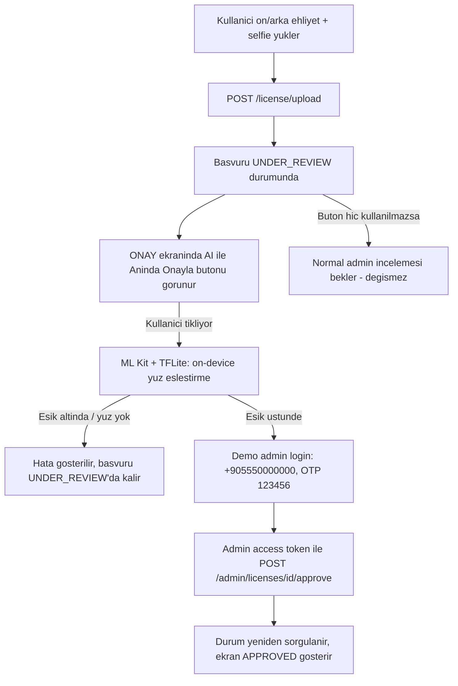

# Yüz Eşleştirme (Face Matching) — Mimari ve Uygulama

Bu döküman, ehliyet doğrulama akışına eklenen yüz eşleştirme özelliğinin mimari
tercihini ve gerçek uygulamayı belgeler. İçerik, özelliğin planlama aşamasında
hazırlanan iki ayrı dökümanın (mimari analiz + uygulama planı) birleştirilmiş ve
gerçek koda göre güncellenmiş halidir; orijinal başlıklandırma korunmuştur.

Orijinal planlama dökümanları, değiştirilmeden arşivlendi ve bu klasöre eklendi:
[`face_matching_architecture_plan.md`](./face_matching_architecture_plan.md)
(Yöntem A/B risk matrisi) ve [`face_matching_plan.md`](./face_matching_plan.md)
(ML Kit/TFLite uygulama planı). Bu döküman, ikisinin gerçek koda yansıyan
sentezidir; planlananla gerçek arasındaki farklar (özellikle akış ve threshold)
aşağıda ayrıca belirtilmiştir.

---

## 1) YÖNTEM KARŞILAŞTIRMASI VE RİSK MATRİSİ

### Yöntem A: Cihaz Üzerinde (Client-Side) Eşleştirme (ML Kit / TFLite) — SEÇİLEN

*Uygulama ehliyet ve selfie resimlerini kendi içinde karşılaştırır.*

- 🟢 **Avantajı:** Çevrimdışı çalışabilirlik, sıfır sunucu maliyeti, sunum sırasında
  yerel hız.
- 🔴 **Kritik Güvenlik Riski (Admin Yetkisi İfşası):** Eşleştirme sonucunu
  `PENDING → CUSTOMER` (ehliyet onayı) geçişine dönüştürmek admin yetkisi
  gerektirir. Bu proje, jüri sunumu için backend'de tanımlı **sabit bir demo admin
  hesabı** (telefon: `+905550000000`) ve backend'in **simüle edilmiş OTP'si**
  (`123456`, gerçek SMS yok) üzerinden bu yetkiyi anlık olarak talep eder — admin
  kimlik bilgisi APK'ya gömülü **statik bir sır değildir**, her seferinde taze
  login ile alınır (bkz. §4).
- 🟡 **İstemci Tarafı Manipülasyonu:** Kötü niyetli bir kullanıcı eşleştirmeyi
  bypass edip doğrudan admin uç noktasına istek atabilir. **Bu MVP/demo kapsamında
  kabul edilen bir risktir** — gerçek bir üründe onay kararı asla istemciye
  gömülü yetkiyle verilmez (bkz. Yöntem B).

### Yöntem B (Reddedilen, prod için referans): Sunucu Üzerinde Eşleştirme + Köprü

*Mobil uygulama resimleri yükler; karşılaştırma ve onaylama ayrı bir backend
servisinde (ör. Python mikroservis + ngrok) gerçekleşir; admin token yalnızca o
servisin `.env`'inde tutulur.*

- 🟢 **Tam Güvenlik:** Admin token mobil uygulamaya hiç sızmaz; onay kararı
  tamamen sunucu tarafında (back-channel) verilir, istemci bypass edemez.
- 🔴 **Neden seçilmedi:** Hoca demo için "uygulama içi yeter" yönlendirmesi verdi;
  ayrı bir Python servisi + tünel (ngrok) kurmak ve sunum sırasında ayakta tutmak
  demo karmaşıklığını artırıyor, MVP kapsamının ötesine geçiyor.

> **Sunum notu:** Bu projede Yöntem A bilinçli bir MVP kısayolu olarak seçildi;
> gerçek bir üründe onay kararının sunucu tarafında verilmesi gerektiği (Yöntem B)
> ve bunun nedeni (istemciye gömülü yetki = decompile edilebilir sır) açıkça
> ayırt edilebilir bir mimari karar olarak burada belgelenmiştir.

---

## 2) TEKNİK MİMARİ (Yüz Eşleştirme)

1. **Yüz Tespiti ve Kırpma:** Google ML Kit Face Detection, ehliyet ön yüz ve
   selfie görsellerindeki yüzü tespit edip kırpar.
2. **Yüz Öznitelik Vektörü Çıkarma:** Kırpılan yüz, TensorFlow Lite (MobileFaceNet,
   `assets/mobile_facenet.tflite`) ile 128 boyutlu bir embedding vektörüne
   dönüştürülür (model input/output boyutları çalışma anında modelden okunur).
3. **Benzerlik Hesaplama:** İki embedding L2-normalize edilip **kosinüs
   benzerliği** hesaplanır. Skor `FaceMatcher.THRESHOLD` üzerindeyse eşleşme
   kabul edilir.

**Threshold kalibrasyonu (planlanandan farklı):** Orijinal uygulama planında
`0.70` gibi akademik benchmark değerleri öngörülmüştü (bkz.
`face_matching_plan.md`). Gerçek test senaryosu bundan çok daha zorlu: kimlik
üzerindeki yüz karta göre küçük bir alan (~1/4), MobileFaceNet burada ince
ayarsız (fine-tune edilmemiş) genel bir model, ve selfie ile kimlik fotoğrafı
arasında açı/ışık/ifade farkı var — üçü birlikte aynı kişi için bile benzerlik
skorunu düşürüyor. Bu yüzden `THRESHOLD` demo/MVP için **`0.35`**'e çekildi
(bilinçli olarak false-negative'i azaltmayı önceliklendiren, güvenliği
zayıflatan bir tercih — kabul edilebilir çünkü bu akış prod-güvenlik sınırı
değil, opsiyonel bir hızlandırma butonu, bkz. §3). `FaceMatcher.match()` her
çağrıda gerçek benzerlik skorunu `Log.d("FaceMatcher", ...)` ile yazar; ilk
gerçek cihaz testlerinden sonra bu değerin gözlemlenen skorlara göre yeniden
kalibre edilmesi beklenir.

**Bağımlılıklar** (`app/build.gradle.kts`): `com.google.mlkit:face-detection:16.1.7`,
`org.tensorflow:tensorflow-lite:2.14.0`, `org.tensorflow:tensorflow-lite-support:0.4.4`,
`androidResources { noCompress += "tflite" }` (model sıkıştırılırsa
`MappedByteBuffer` ile okunamaz).

**Dosya:** `util/FaceMatcher.kt` — `match(licenseBytes, selfieBytes): FaceMatchResult`
(`Success(similarity, isMatch)` / `NoFaceInLicense` / `NoFaceInSelfie` / `Error`).

---

## 3) GERÇEK İŞ AKIŞI (uygulanan hali)

Planlama aşamasında düşünülenden farklı olarak, yüz eşleştirme **zorunlu bir
upload kapısı değil, opsiyonel bir hızlandırma butonudur** — normal ehliyet
inceleme sürecini asla engellemez.

Kritik nokta: **D adımı hiç tetiklenmezse veya E/G/H başarısız olursa**, başvuru
sıradan `UNDER_REVIEW` durumunda kalır ve gerçek bir admin'in incelemesini
bekler — AI butonu yalnızca bu bekleyişi *kısaltabilen*, isteğe bağlı bir yoldur.

---

## 4) UYGULAMA DETAYLARI (DOSYA DÖKÜMÜ)

| Dosya | İşlem | Not |
| :--- | :--- | :--- |
| `app/build.gradle.kts` | Değişti | ML Kit + TFLite bağımlılıkları, `noCompress("tflite")` |
| `app/src/main/assets/mobile_facenet.tflite` | Eklendi | ~5MB, önceden eğitilmiş MobileFaceNet |
| `util/FaceMatcher.kt` | Eklendi | Yüz tespit + embedding + kosinüs benzerliği |
| `data/remote/ApiConfig.kt` | Eklendi | Paylaşılan `BASE_URL` (tek kaynak — `NetworkModule` de bunu kullanır) |
| `data/remote/AdminApprovalService.kt` | Eklendi | İzole Retrofit arayüzü: `login`, `verifyOtp`, `approve` (elle `Authorization` header) |
| `di/AdminApprovalModule.kt` | Eklendi | **`AuthInterceptor`/`TokenAuthenticator` içermeyen ayrı bir OkHttp/Retrofit.** Ana ağ katmanı her isteğe müşterinin token'ını koşulsuz bastığından (`AuthInterceptor.intercept`), admin onayı bu izole katmandan gitmezse müşteri token'ı admin token'ın yerini alır ve çağrı `403` döner. |
| `data/repository/AdminApprovalRepository.kt` | Eklendi | Demo admin login → OTP `123456` → admin token → `approve(licenseId)`. Sabitler `private companion object` içinde, "demo/MVP" notuyla işaretli. |
| `ui/auth/license/LicenseContract.kt` | Değişti | `licenseId`, `isAiApproving` state; `RequestAiApproval` intent |
| `ui/auth/license/LicenseViewModel.kt` | Değişti | Upload sonrası `licenseId` + görsel byte'ları (`cachedFrontBytes`/`cachedSelfieBytes`) önbelleğe alınır (sunucu selfie'yi status yanıtında geri vermediği için); `requestAiApproval()` eşleştirme + onay zincirini yürütür, başarıda `checkLicenseStatus()` ile gerçek durumu sunucudan tazeler. |
| `ui/auth/license/LicenseScreen.kt` | Değişti | `UNDER_REVIEW` durumunda "AI ile Anında Onayla" butonu (mevcut `MockBypassApprove` — yalnız `REJECTED`'de görünen ayrı bir demo butonu — değiştirilmedi). |

### Bilinen sınırlar
- **Süreç ölümü (process death):** `cachedFrontBytes`/`cachedSelfieBytes` bellekte
  tutulur; ViewModel yeniden yaratılırsa (ör. uygulama arka planda öldürülürse)
  kaybolur. Bu durumda AI butonu kullanıcıyı normal incelemeye yönlendiren bir
  hata gösterir — akış kesilmez, sadece hızlandırma fırsatı kaçar.

  **Gerçek gözlem (17.07.2026):** Sabah oluşturulan bir test hesabında, ehliyet
  yüklendikten uzun süre sonra (uygulama arka planda kapanıp tekrar açıldıktan
  sonra) "AI ile Anında Onayla" denendiğinde tam bu senaryo tetiklendi: buton
  *"AI onayı bu oturumda kullanılamıyor. Lütfen normal incelemeyi bekleyin."*
  hatasını gösterdi. Kök neden doğrulandı — `cachedFrontBytes`/`cachedSelfieBytes`/
  `licenseId` hiçbiri kalıcı depoya yazılmıyor (yalnızca `private var`, bellekte);
  ViewModel'in araya giren bir süreç yeniden başlatmasıyla sıfırlanması bekleniyor.
  Sunucu selfie'yi `GET /license/status` yanıtında geri vermediği için (yalnızca
  upload yanıtında bir kerelik döner), görselleri sunucudan yeniden çekmek de
  mümkün değil.

  **Değerlendirilen alternatifler:**
  1. *Demo protokolü olarak kabul et* — "yükle, hemen ardından AI onayla" sırasını
     bozmadan göster; kod değişikliği gerektirmez.
  2. *Backend'den selfie URL'sini `status` yanıtına ekletme* — kalıcı çözüm ama
     backend değişikliği gerektirir, bu ekibin kontrolünde değil.
  3. *`licenseId`'yi `SharedPreferences`'a kalıcı yaz* (görselleri değil — onlar
     zaten sunucudan geri alınamıyor) ve kullanıcıdan AI onayı için görselleri
     yeniden seçmesini iste — orta yol, UX'i karmaşıklaştırır.

  **Karar (17.07.2026, demo kapsamı için):** 1. seçenek benimsendi, davranış
  **değiştirilmeyecek**. Gerekçe: bu bir MVP/jüri-demo hızlandırma özelliği,
  ana onay akışını (normal admin incelemesi) hiçbir şekilde engellemiyor; 2.
  seçenek kapsam dışı bir backend bağımlılığı, 3. seçenek ise kazanılan UX
  değerine kıyasla gereksiz karmaşıklık katıyor. Demoda "yükle → hemen AI ile
  onayla" sırası gösterilecek; sabah yüklenip sonra denenen senaryo gibi
  session-arası kullanım, beklenen (dokümante edilmiş) sınırlamadır, bug değil.
- **Refresh token'a dokunulmaz:** Admin akışı `TokenManager`/`SessionManager`'dan
  tamamen bağımsızdır; müşterinin oturumunu veya refresh-token rotasyonunu
  hiçbir şekilde etkilemez (ayrı Retrofit örneği, ayrı OkHttpClient).
- **Eşik değeri:** `FaceMatcher.THRESHOLD = 0.35f` (bkz. §2 kalibrasyon notu).
  Düşük tutulması false-accept riskini artırır; bu, demo kapsamında ve akışın
  opsiyonel/geri döndürülebilir olması (eşleşmezse normal inceleme devam eder)
  nedeniyle kabul edilen bir trade-off'tur, prod için geçerli değildir.
